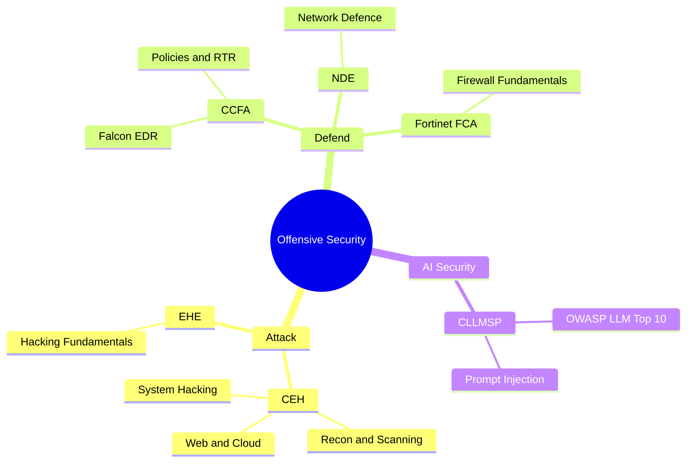
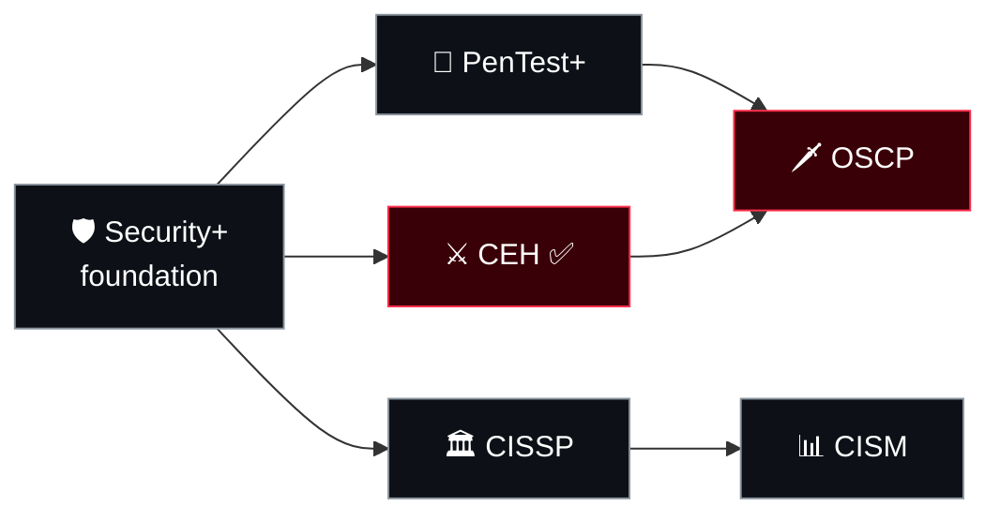

<div align="center">


</div>

```console
root@rochacrypt:~# ls ~/knowledge-base
certs/     ceh  ccfa  cllmsp  fortinet-fca  ehe-nde
roadmaps/  oscp  security-plus  pentest-plus  cissp  cism
```

Visual mind maps and condensed notes for the certifications I hold — built to be **studied, not just read**. Each map links the exam topics to how they show up in real engagements.

## 🗺️ The Big Picture



## 🧭 Certification Roadmap



<sub>Technical track on top, management track below. ✅ = certification I hold.</sub>

## ✅ My Certifications — study maps from experience

| Map | Focus | Level |
| :--- | :--- | :--- |
| [**CEH** — Certified Ethical Hacker](./certs/ceh.md) | Full offensive lifecycle, 20 modules | ⭐⭐⭐ |
| [**CCFA** — CrowdStrike Falcon Administrator](./certs/ccfa.md) | EDR administration, policies, RTR | ⭐⭐⭐ |
| [**CLLMSP** — LLM Security](./certs/cllmsp.md) | OWASP Top 10 for LLM Applications | ⭐⭐ |
| [**Fortinet FCA**](./certs/fortinet-fca.md) | Security fundamentals & FortiGate basics | ⭐ |
| [**EHE & NDE** — EC-Council Essentials](./certs/ehe-nde.md) | Attack & defence foundations | ⭐ |

## 📖 Industry Roadmaps — popular certifications mapped

| Map | Track | Format |
| :--- | :--- | :--- |
| [**OSCP**](./roadmaps/oscp.md) — OffSec Certified Professional | 🔴 Offensive | 24h practical + report |
| [**PenTest+**](./roadmaps/pentest-plus.md) — CompTIA | 🔴 Offensive | Multiple choice + PBQs |
| [**Security+**](./roadmaps/security-plus.md) — CompTIA | ⚪ Foundation | Multiple choice + PBQs |
| [**CISSP**](./roadmaps/cissp.md) — ISC2 | 🔵 Management | Adaptive, 8 domains |
| [**CISM**](./roadmaps/cism.md) — ISACA | 🔵 Management | Multiple choice, 4 domains |

> Industry roadmaps are study maps built from each certification's public outline — not certifications I claim to hold.

## 🧭 How to Use

1. **Start with the mind map** — get the shape of the domain before the details.
2. **Read the "In the field" notes** — see how each topic appears in real work.
3. **Tick the checklist** — fork the repo and track your own progress.

## 💬 Engage

- ⭐ **Star** the repo if it helped you study.
- 💡 Spotted a gap or error? Open an [issue](../../issues) or a pull request.
- 🗣️ Questions about a topic or exam? Start a [discussion](../../discussions).

> ⚠️ For education and **authorised testing only**. These notes are my own study material and are not official exam content.
