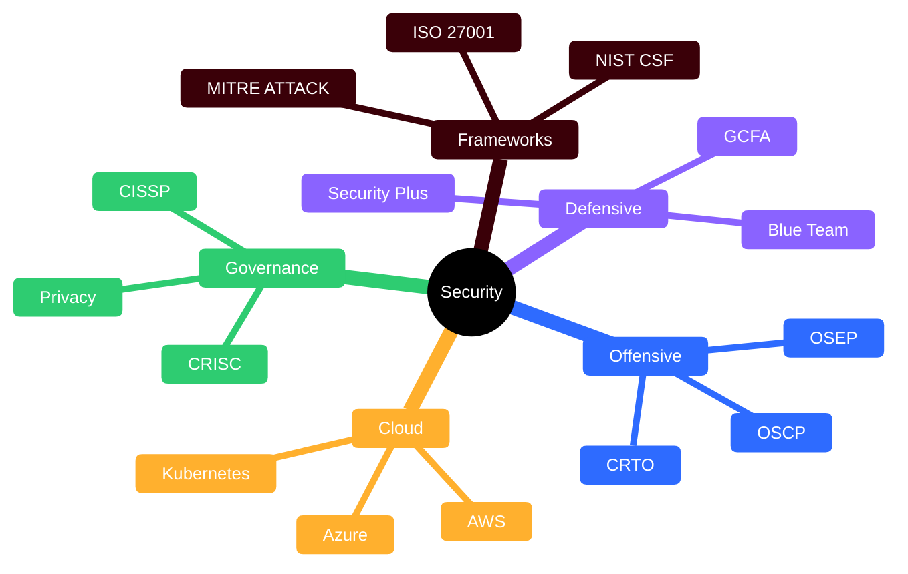

<div align="center">


<a href="https://github.com/RochaCrypt"></a>

<br/><br/>


</div>

```console
root@rochacrypt:~# ls ~/security-knowledge-base | wc -l
50   # certifications & frameworks, 5 I hold ✔️
```

The **50 security certifications and frameworks** that matter, each distilled to the same shape so a visitor can size up any credential in under a minute:

`🔎 What it is` · `🎯 What it validates` · `🧠 Key concepts` · `🗺️ Mind map` · `🔥 In the field`

## 🗺️ The Landscape



## 📇 Jump to a track

**🔴 Offensive Security** (12) · **🔵 Defensive & Blue Team** (12) · **☁️ Cloud Security** (7) · **📊 Governance, Risk & AI** (8) · **🧭 Frameworks & Standards** (11)

<sub>Level: ⭐ foundation → ⭐⭐⭐⭐⭐ expert · ✔️ = a credential I personally hold</sub>

---

## 🔴 Offensive Security

| | Cert / Framework | Focus | Level |
| :-: | :--- | :--- | :-- |
| ⚔️ | [**CEH**](./catalog/ceh.md) ✔️ | Broad offensive fundamentals | ⭐⭐⭐ |
| 🐣 | [**eJPT**](./catalog/ejpt.md) | Beginner practical pentest | ⭐ |
| 🟠 | [**BSCP**](./catalog/bscp.md) | Hands-on web (Burp) | ⭐⭐⭐ |
| 🎯 | [**PenTest+**](./catalog/pentest-plus.md) | Pentest + engagement mgmt | ⭐⭐⭐ |
| 🎖️ | [**PNPT**](./catalog/pnpt.md) | Real-world engagement + debrief | ⭐⭐⭐ |
| 🌐 | [**GWAPT**](./catalog/gwapt.md) | Web app pentest (GIAC) | ⭐⭐⭐ |
| 🏰 | [**CRTP**](./catalog/crtp.md) | Active Directory attacks | ⭐⭐⭐ |
| 🗡️ | [**OSCP**](./catalog/oscp.md) | Hands-on pentest benchmark | ⭐⭐⭐⭐ |
| 👹 | [**CRTO**](./catalog/crto.md) | Red team ops & C2 | ⭐⭐⭐⭐ |
| 🥷 | [**OSEP**](./catalog/osep.md) | Evasion & advanced attacks | ⭐⭐⭐⭐⭐ |
| 🕷️ | [**OSWE**](./catalog/oswe.md) | White-box web exploitation | ⭐⭐⭐⭐⭐ |
| 🧬 | [**GXPN**](./catalog/gxpn.md) | Exploit dev & advanced pentest | ⭐⭐⭐⭐⭐ |

## 🔵 Defensive & Blue Team

| | Cert / Framework | Focus | Level |
| :-: | :--- | :--- | :-- |
| 🔰 | [**EHE & NDE**](./catalog/essentials.md) ✔️ | Attack + defence basics | ⭐ |
| 🛡️ | [**Security+**](./catalog/security-plus.md) | Security foundations | ⭐ |
| 🧱 | [**Fortinet FCA**](./catalog/fortinet-fca.md) ✔️ | FortiGate fundamentals | ⭐ |
| 🔷 | [**BTL1**](./catalog/btl1.md) | Practical blue team | ⭐⭐ |
| 📗 | [**GSEC**](./catalog/gsec.md) | Broad security essentials | ⭐⭐ |
| 🔧 | [**SSCP**](./catalog/sscp.md) | Operational security | ⭐⭐⭐ |
| 📈 | [**CySA+**](./catalog/cysa-plus.md) | SOC & threat analytics | ⭐⭐⭐ |
| 🚨 | [**GCIH**](./catalog/gcih.md) | Incident handling | ⭐⭐⭐ |
| 🦅 | [**CCFA**](./catalog/ccfa.md) ✔️ | CrowdStrike Falcon admin | ⭐⭐⭐ |
| 🟦 | [**SC-200**](./catalog/sc-200.md) | Microsoft SOC (Sentinel) | ⭐⭐⭐ |
| 🔬 | [**GCFA**](./catalog/gcfa.md) | Forensics & DFIR | ⭐⭐⭐⭐ |
| 🔶 | [**BTL2**](./catalog/btl2.md) | Advanced blue team | ⭐⭐⭐⭐ |

## ☁️ Cloud Security

| | Cert / Framework | Focus | Level |
| :-: | :--- | :--- | :-- |
| ⛅ | [**CCSK**](./catalog/ccsk.md) | Vendor-neutral cloud basics | ⭐⭐ |
| 🟦 | [**AZ-500**](./catalog/az-500.md) | Azure security engineer | ⭐⭐⭐ |
| 🟧 | [**AWS Security Specialty**](./catalog/aws-security.md) | Security across AWS | ⭐⭐⭐⭐ |
| 🟪 | [**CCSP**](./catalog/ccsp.md) | Vendor-neutral cloud (ISC2) | ⭐⭐⭐⭐ |
| 🟥 | [**GCP Security Engineer**](./catalog/gcp-security.md) | Security on Google Cloud | ⭐⭐⭐⭐ |
| ☸️ | [**CKS**](./catalog/cks.md) | Kubernetes security | ⭐⭐⭐⭐ |
| 🏢 | [**SC-100**](./catalog/sc-100.md) | Cybersecurity architect | ⭐⭐⭐⭐⭐ |

## 📊 Governance, Risk & AI

| | Cert / Framework | Focus | Level |
| :-: | :--- | :--- | :-- |
| 🤖 | [**CLLMSP**](./catalog/cllmsp.md) ✔️ | LLM application security | ⭐⭐ |
| 📋 | [**CGRC**](./catalog/cgrc.md) | Authorisation & RMF | ⭐⭐⭐ |
| 🔐 | [**CDPSE**](./catalog/cdpse.md) | Technical data privacy | ⭐⭐⭐ |
| 🇪🇺 | [**CIPP/E**](./catalog/cipp-e.md) | European privacy law (GDPR) | ⭐⭐⭐ |
| ⚖️ | [**CRISC**](./catalog/crisc.md) | IT risk management | ⭐⭐⭐⭐ |
| 🔍 | [**CISA**](./catalog/cisa.md) | IT audit & assurance | ⭐⭐⭐⭐ |
| 📊 | [**CISM**](./catalog/cism.md) | Security programme mgmt | ⭐⭐⭐⭐ |
| 🏛️ | [**CISSP**](./catalog/cissp.md) | Senior security management | ⭐⭐⭐⭐ |

## 🧭 Frameworks & Standards

| | Cert / Framework | Focus | Level |
| :-: | :--- | :--- | :-- |
| 🎛️ | [**MITRE ATT&CK**](./catalog/mitre-attack.md) | Adversary tactics matrix | — |
| 🛠️ | [**MITRE D3FEND**](./catalog/mitre-d3fend.md) | Defensive countermeasures | — |
| ⛓️ | [**Cyber Kill Chain**](./catalog/cyber-kill-chain.md) | 7-stage intrusion model | — |
| 🏗️ | [**NIST CSF 2.0**](./catalog/nist-csf.md) | Risk-based framework | — |
| ✅ | [**CIS Controls**](./catalog/cis-controls.md) | Prioritised safeguards | — |
| 📕 | [**ISO/IEC 27001**](./catalog/iso-27001.md) | ISMS standard | — |
| 📑 | [**SOC 2**](./catalog/soc2.md) | Trust & assurance report | — |
| 💳 | [**PCI DSS**](./catalog/pci-dss.md) | Payment card security | — |
| 🕸️ | [**OWASP Top 10**](./catalog/owasp-top10.md) | Web app risks | — |
| 🧩 | [**PTES**](./catalog/ptes.md) | Pentest methodology | — |
| 🌡️ | [**CVSS**](./catalog/cvss.md) | Vulnerability scoring | — |

---

## 🤝 Contribute

A living catalog — corrections and additions welcome.

- ⭐ **Star** it if it's useful — it helps others find it.
- 🐛 Open an [issue](../../issues) for corrections or an updated exam code.
- 💬 Ask or discuss in [Discussions](../../discussions).

> ⚠️ Exam formats, codes and framework versions change. Each page links its official source — **always verify current details there** before booking or citing. Maps for credentials I don't personally hold are study references built from public outlines, and are marked without the ✔️.

<div align="center">

<br/>

<a href="https://github.com/RochaCrypt"></a>

<sub>🔐 For education and authorised testing only.</sub>

</div>
