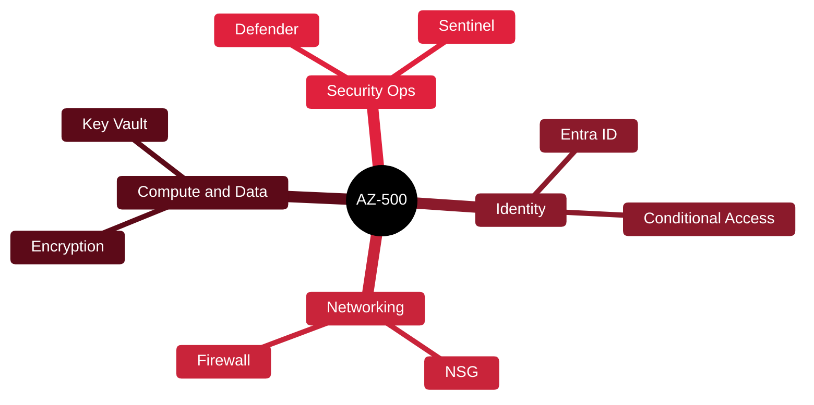

# 🟦 AZ-500 — Azure Security Engineer

[🏠 Profile](https://github.com/RochaCrypt) · [📚 Catalog](../README.md) · 

> Microsoft · securing Azure identity, network and workloads.

## 🔎 What it is

Microsoft's associate-level security certification. Proves you can manage identity and access, secure networking and compute, and run security operations in Azure.

## 🎯 What it validates

- Identity and access with Entra ID
- Securing networking
- Securing compute, storage and databases
- Security operations with Defender and Sentinel

## 🧠 Key concepts & definitions

| Term | Definition |
| :--- | :--- |
| **Entra ID** | Microsoft's cloud identity service (formerly Azure AD) |
| **Conditional Access** | Policies granting access based on user/risk/device signals |
| **NSG** | Network Security Group filtering traffic in Azure |
| **Microsoft Sentinel** | Cloud-native SIEM/SOAR |
| **Defender for Cloud** | Azure's posture management and workload protection |

## 🗺️ Mind map

## 📌 Fast facts

| | |
| :--- | :--- |
| Issuer | Microsoft |
| Level | Intermediate ⭐⭐⭐ |
| Format | MCQ + case studies |
| Note | Verify current exam code — Microsoft updates often |

## 🔥 In the field

- Conditional Access is the single highest-leverage control in Azure identity.
- Sentinel + Defender data is where cloud incident response actually happens.

## 🔗 Official

- [Microsoft AZ-500](https://learn.microsoft.com/en-us/credentials/certifications/azure-security-engineer/)

---

