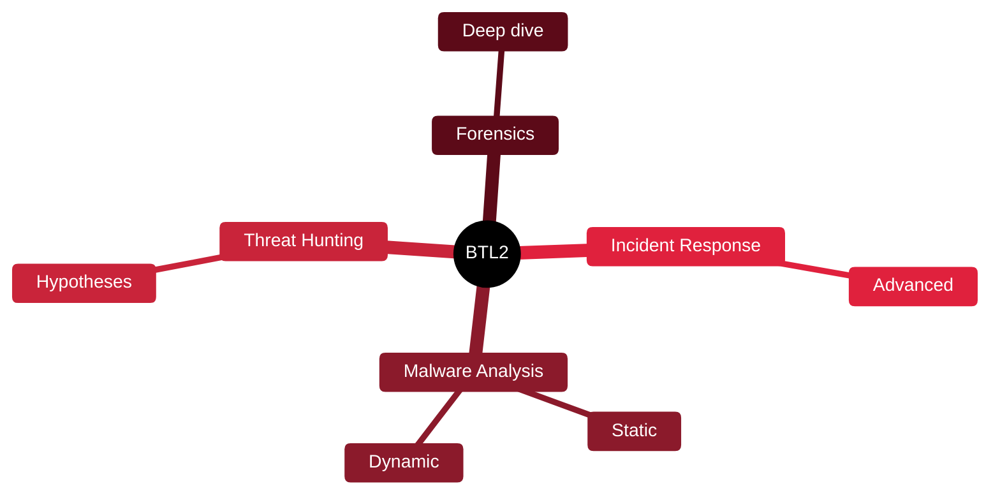

# 🔶 BTL2 — Blue Team Level 2

[🏠 Profile](https://github.com/RochaCrypt) · [📚 Catalog](../README.md) · 

> Security Blue Team · advanced, hands-on defensive operations.

## 🔎 What it is

The advanced follow-up to BTL1, going deeper into malware analysis, advanced threat hunting, digital forensics and incident response through a demanding hands-on exam.

## 🎯 What it validates

- Malware analysis
- Advanced threat hunting
- Digital forensics
- Advanced incident response

## 🧠 Key concepts & definitions

| Term | Definition |
| :--- | :--- |
| **Static analysis** | Examining malware without running it |
| **Dynamic analysis** | Running malware in a sandbox to observe behaviour |
| **Threat hunting hypothesis** | A testable idea about how an attacker might be present |
| **Persistence mechanism** | How malware survives reboots |
| **Sandbox** | Isolated environment for safe analysis |

## 🗺️ Mind map

## 📌 Fast facts

| | |
| :--- | :--- |
| Issuer | Security Blue Team |
| Level | Advanced ⭐⭐⭐⭐ |
| Format | Hands-on practical exam |
| Prereq | BTL1-level skills |

## 🔥 In the field

- Malware analysis skills turn 'the AV flagged something' into real understanding.
- Hypothesis-driven hunting finds what signature detection misses.

## 🔗 Official

- [Security Blue Team BTL2](https://securityblue.team/why-btl2/)

---

