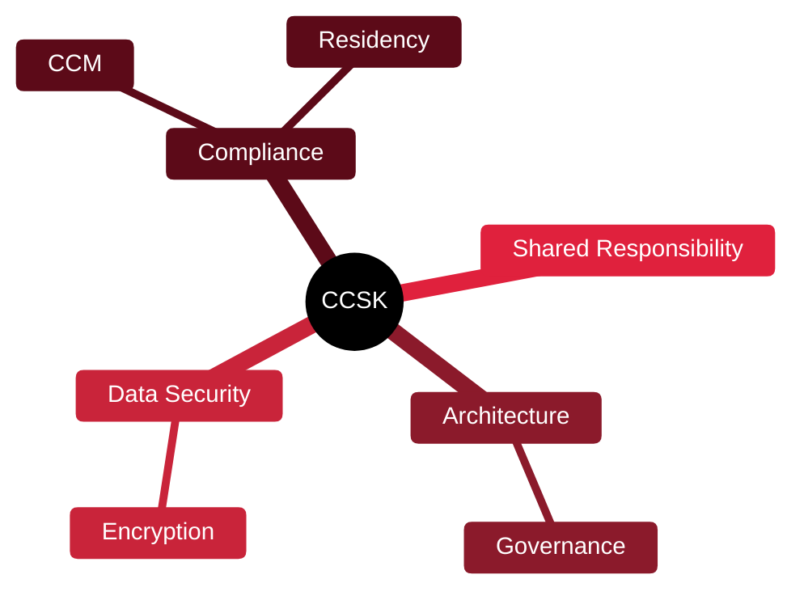

# ⛅ CCSK — Certificate of Cloud Security Knowledge

[🏠 Profile](https://github.com/RochaCrypt) · [📚 Catalog](../README.md) · 

> Cloud Security Alliance · vendor-neutral cloud security foundations.

## 🔎 What it is

A widely recognised, vendor-neutral cloud security certificate from the Cloud Security Alliance, based on their Security Guidance, Cloud Controls Matrix and ENISA recommendations. Often a precursor to CCSP.

## 🎯 What it validates

- Cloud architecture and governance
- Data security and encryption
- Compliance and the shared responsibility model
- The CSA Cloud Controls Matrix

## 🧠 Key concepts & definitions

| Term | Definition |
| :--- | :--- |
| **Cloud Controls Matrix** | CSA's control framework mapped to standards |
| **Shared responsibility** | Split of duties between provider and customer |
| **Multi-tenancy** | Many customers sharing the same infrastructure |
| **Data residency** | Where data is legally stored |
| **Governance** | Policies steering cloud usage and risk |

## 🗺️ Mind map

## 📌 Fast facts

| | |
| :--- | :--- |
| Issuer | Cloud Security Alliance |
| Level | Foundation–Intermediate ⭐⭐ |
| Format | Open-book online exam |
| Nature | Knowledge-based, vendor-neutral |

## 🔥 In the field

- Great vendor-neutral base before diving into AWS/Azure/GCP specifics.
- The Cloud Controls Matrix is a handy mapping tool in real audits.

## 🔗 Official

- [CSA CCSK](https://cloudsecurityalliance.org/education/ccsk/)

---

