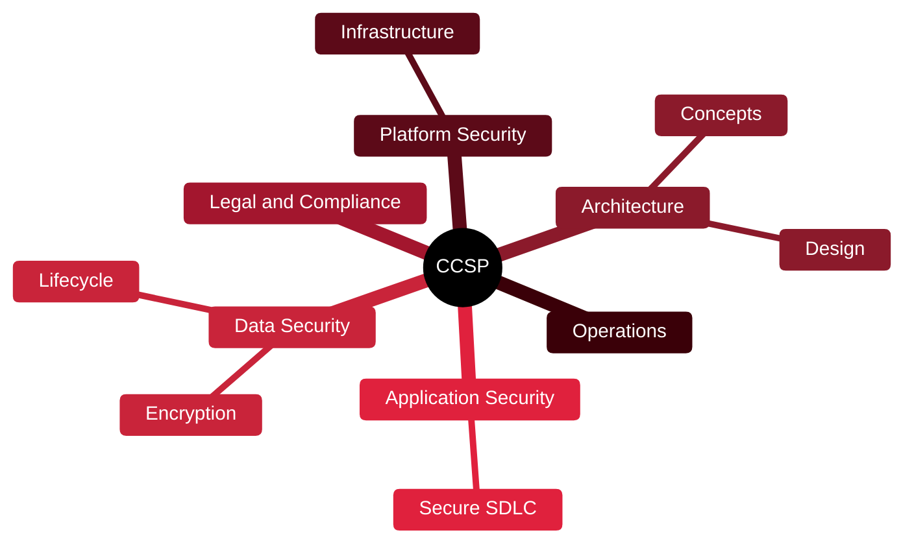

# 🟪 CCSP — Certified Cloud Security Professional

[🏠 Profile](https://github.com/RochaCrypt) · [📚 Catalog](../README.md) · 

> ISC2 · vendor-neutral cloud security architecture and governance.

## 🔎 What it is

A senior, vendor-neutral cloud security certification from ISC2. Covers designing, securing and governing cloud environments across six domains — architecture rather than one provider's console.

## 🎯 What it validates

- Cloud concepts, architecture and design
- Cloud data and application security
- Platform and infrastructure security
- Operations, legal, risk and compliance

## 🧠 Key concepts & definitions

| Term | Definition |
| :--- | :--- |
| **Shared responsibility** | Split of security duties between provider and customer |
| **Data lifecycle** | Create, store, use, share, archive, destroy |
| **Tokenisation** | Replacing sensitive data with non-sensitive tokens |
| **CASB** | Cloud Access Security Broker enforcing policy between users and cloud |
| **Residency** | Where data is physically stored, for legal compliance |

## 🗺️ Mind map

## 📌 Fast facts

| | |
| :--- | :--- |
| Issuer | ISC2 |
| Level | Advanced ⭐⭐⭐⭐ |
| Format | 125 questions · 3h |
| Prereq | 5 years IT, 3 in security, 1 in cloud |

## 🔥 In the field

- Vendor-neutral view helps in multi-cloud shops where AWS-only skills fall short.
- Pairs naturally with CISSP for a governance-heavy career path.

## 🔗 Official

- [ISC2 CCSP](https://www.isc2.org/certifications/ccsp)

---

