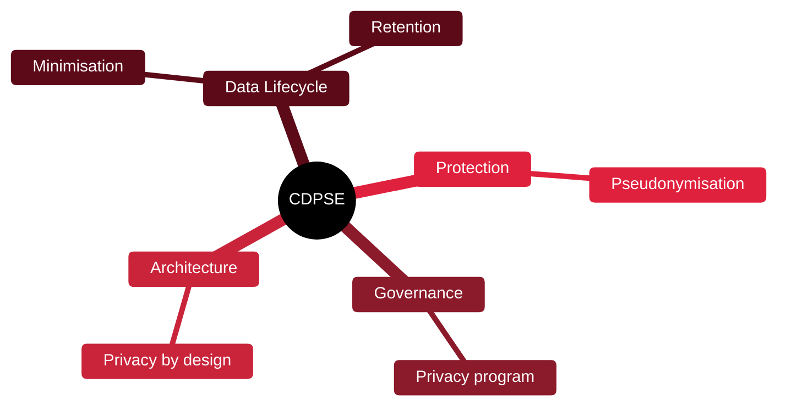

# 🔐 CDPSE — Certified Data Privacy Solutions Engineer

[🏠 Profile](https://github.com/RochaCrypt) · [📚 Catalog](../README.md) · 

> ISACA · building privacy into technology by design.

## 🔎 What it is

An ISACA certification focused on the technical implementation of privacy — turning privacy requirements into engineered controls across the data lifecycle. Bridges legal privacy and engineering.

## 🎯 What it validates

- Privacy governance
- Privacy architecture
- Data lifecycle and protection
- Privacy by design in systems

## 🧠 Key concepts & definitions

| Term | Definition |
| :--- | :--- |
| **Privacy by design** | Building privacy in from the start, not bolting it on |
| **Data minimisation** | Collecting only what's necessary |
| **Pseudonymisation** | Replacing identifiers to reduce linkability |
| **Data lifecycle** | Create, store, use, share, retain, destroy |
| **PII** | Personally Identifiable Information |

## 🗺️ Mind map

## 📌 Fast facts

| | |
| :--- | :--- |
| Issuer | ISACA |
| Level | Intermediate ⭐⭐⭐ |
| Format | 120 questions · 3.5h |
| Focus | Technical privacy |

## 🔥 In the field

- Privacy is now an engineering concern, not just a legal one.
- Data minimisation quietly shrinks both risk and breach impact.

## 🔗 Official

- [ISACA CDPSE](https://www.isaca.org/credentialing/cdpse)

---

