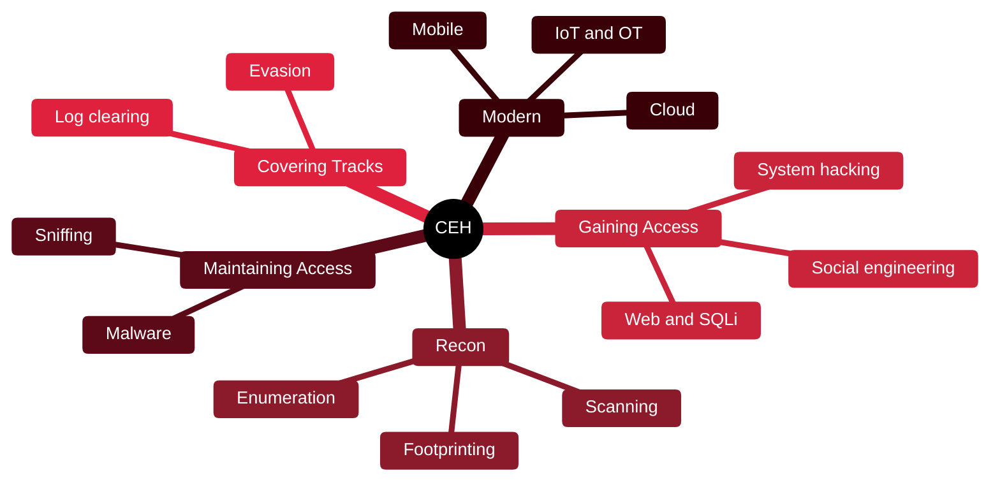

# ⚔️ CEH — Certified Ethical Hacker

[🏠 Profile](https://github.com/RochaCrypt) · [📚 Catalog](../README.md) · 

> EC-Council · broad offensive fundamentals across 20 modules. 

## 🔎 What it is

A vendor-neutral certification proving you understand how attackers think and operate across the full hacking lifecycle. It is knowledge-broad rather than deeply hands-on, and is often an HR filter for security roles.

## 🎯 What it validates

- The 5 phases: recon, scanning, gaining access, maintaining access, covering tracks
- Attacks across web, network, wireless, mobile, cloud, IoT/OT
- Malware, sniffing, social engineering and DoS
- Cryptography and evasion of IDS/firewalls

## 🧠 Key concepts & definitions

| Term | Definition |
| :--- | :--- |
| **Footprinting** | Gathering information about a target passively or actively before attacking |
| **Enumeration** | Extracting usernames, shares and services from a system |
| **Privilege escalation** | Moving from a low-privilege account to admin/root |
| **IDS/Firewall evasion** | Techniques to avoid detection during an attack |
| **CIA triad** | Confidentiality, Integrity, Availability — the goals security protects |

## 🗺️ Mind map

## 📌 Fast facts

| | |
| :--- | :--- |
| Issuer | EC-Council |
| Level | Intermediate ⭐⭐⭐ |
| Format | 125 MCQ · 4h (+ optional practical) |
| Validity | 3 years (ECE credits) |

## 🔥 In the field

- Recon and enumeration are where most real findings begin — not clever exploits.
- Great shared vocabulary for reports and interviews, even if the exam is theory-heavy.

## 🔗 Official

- [EC-Council CEH](https://www.eccouncil.org/train-certify/certified-ethical-hacker-ceh/)

---

