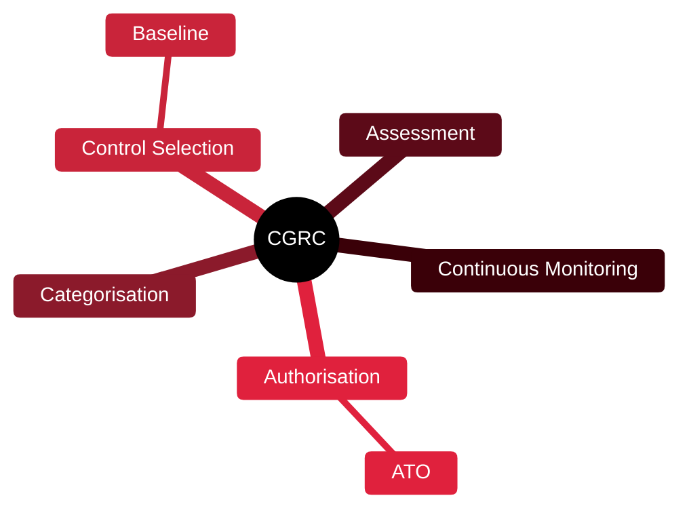

# 📋 CGRC — Certified in Governance, Risk and Compliance

[🏠 Profile](https://github.com/RochaCrypt) · [📚 Catalog](../README.md) · 

> ISC2 (formerly CAP) · authorising systems using risk frameworks.

## 🔎 What it is

An ISC2 certification (previously CAP) focused on the process of authorising and maintaining information systems using a risk management framework such as NIST RMF — the bridge between security and compliance.

## 🎯 What it validates

- Applying a Risk Management Framework (RMF)
- System categorisation and control selection
- Assessment and authorisation
- Continuous monitoring

## 🧠 Key concepts & definitions

| Term | Definition |
| :--- | :--- |
| **RMF** | Risk Management Framework — a structured authorisation process |
| **Categorisation** | Rating a system's impact level |
| **Control baseline** | The starting set of controls for that level |
| **ATO** | Authorization to Operate — formal sign-off to run a system |
| **Continuous monitoring** | Ongoing checks that controls still work |

## 🗺️ Mind map

## 📌 Fast facts

| | |
| :--- | :--- |
| Issuer | ISC2 (formerly CAP) |
| Level | Intermediate–Advanced ⭐⭐⭐ |
| Format | 125 questions · 3h |
| Focus | RMF / authorisation |

## 🔥 In the field

- Common in government and regulated sectors that live by NIST RMF.
- Translates technical controls into the compliance language auditors need.

## 🔗 Official

- [ISC2 CGRC](https://www.isc2.org/certifications/cgrc)

---

