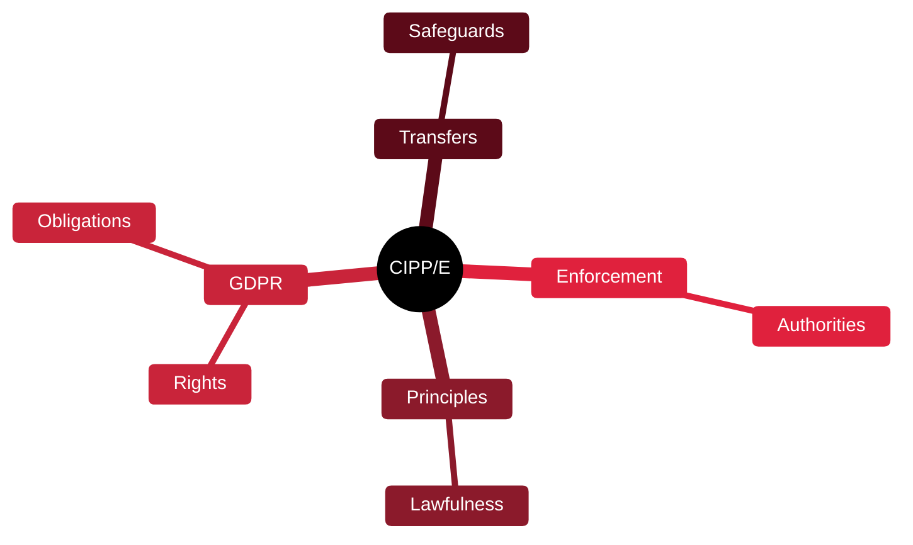

# 🇪🇺 CIPP/E — Certified Information Privacy Professional/Europe

[🏠 Profile](https://github.com/RochaCrypt) · [📚 Catalog](../README.md) · 

> IAPP · European data protection law, centred on GDPR.

## 🔎 What it is

The leading privacy-law certification from the IAPP, focused on European data protection — principally the GDPR. It is legal and regulatory rather than technical, valued in privacy and compliance roles.

## 🎯 What it validates

- European data protection principles
- GDPR rights and obligations
- Lawful bases and transfers
- Enforcement and supervisory authorities

## 🧠 Key concepts & definitions

| Term | Definition |
| :--- | :--- |
| **GDPR** | EU General Data Protection Regulation |
| **Lawful basis** | The legal justification for processing personal data |
| **Data subject rights** | Access, erasure, portability and more |
| **DPO** | Data Protection Officer |
| **Cross-border transfer** | Moving personal data outside the EU under safeguards |

## 🗺️ Mind map

## 📌 Fast facts

| | |
| :--- | :--- |
| Issuer | IAPP |
| Level | Intermediate ⭐⭐⭐ |
| Format | 90 questions · 2.5h |
| Nature | Legal / regulatory |

## 🔥 In the field

- A must-have where GDPR applies — which is far beyond Europe's borders.
- Pairs well with a technical cert: law plus implementation is a strong combo.

## 🔗 Official

- [IAPP CIPP/E](https://iapp.org/certify/cippe/)

---

