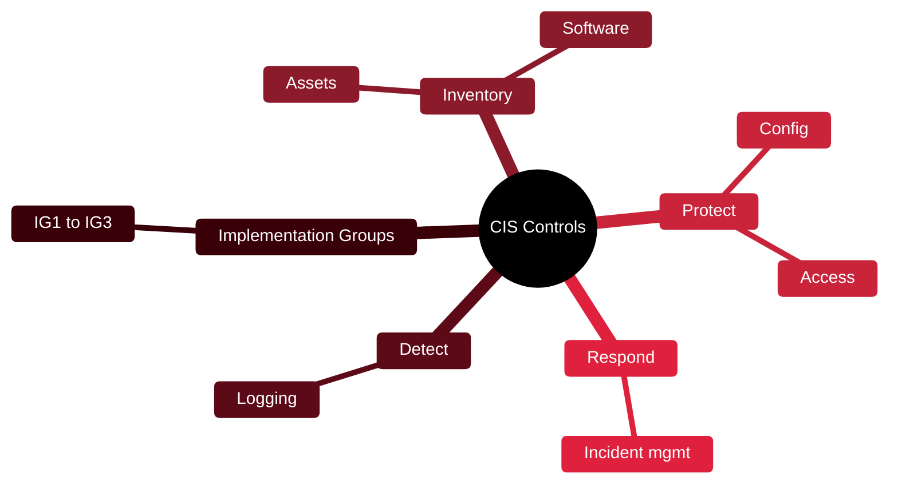

# ✅ CIS Controls

[🏠 Profile](https://github.com/RochaCrypt) · [📚 Catalog](../README.md) · 

> Center for Internet Security · a prioritised set of defensive actions.

## 🔎 What it is

A prioritised, practical set of safeguards (v8 has 18 controls) that defend against the most common attacks. Implementation Groups let organisations of any size adopt what fits their risk and resources.

## 🎯 What it validates

- Prioritises the highest-impact defences
- Groups controls by organisation maturity
- Maps to other frameworks
- Provides concrete, actionable safeguards

## 🧠 Key concepts & definitions

| Term | Definition |
| :--- | :--- |
| **Safeguard** | A specific action within a control |
| **Implementation Group** | IG1–IG3, scaling controls to org size/risk |
| **Inventory** | Knowing your assets and software — controls 1 & 2 |
| **Prioritisation** | Doing the most impactful things first |
| **Basic cyber hygiene** | The essential IG1 baseline every org should meet |

## 🗺️ Mind map

## 📌 Fast facts

| | |
| :--- | :--- |
| Maintained by | Center for Internet Security |
| Version | v8 |
| Controls | 18 |
| Cost | Free |

## 🔥 In the field

- The clearest starting point when someone asks 'where do we even begin?'
- IG1 is a realistic baseline that already stops most opportunistic attacks.

## 🔗 Official

- [CIS Controls](https://www.cisecurity.org/controls)

---

