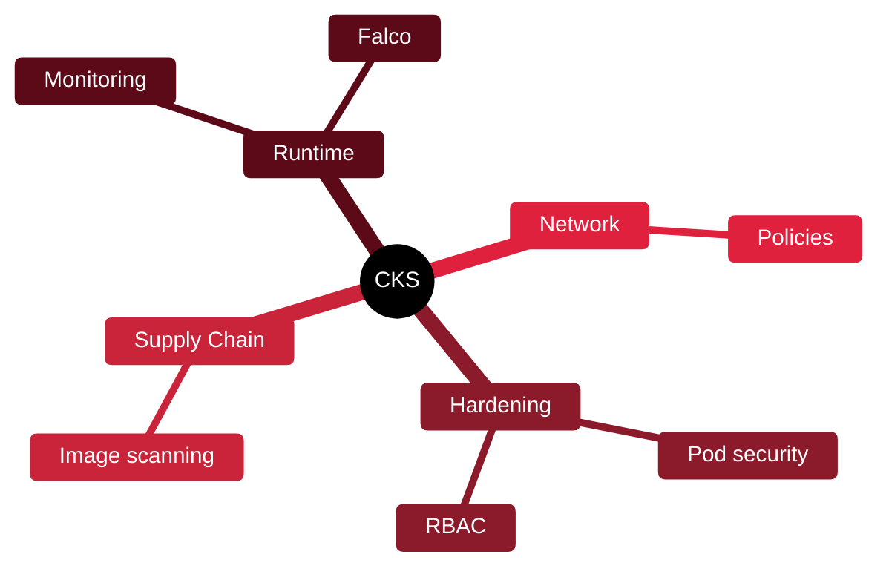

# ☸️ CKS — Certified Kubernetes Security Specialist

[🏠 Profile](https://github.com/RochaCrypt) · [📚 Catalog](../README.md) · 

> CNCF · hands-on security for Kubernetes clusters.

## 🔎 What it is

A fully practical certification from the CNCF proving you can secure Kubernetes clusters — hardening, supply chain, runtime security and monitoring. Requires the CKA certification first.

## 🎯 What it validates

- Cluster setup and hardening
- Supply-chain security
- Runtime security and monitoring
- Minimising microservice vulnerabilities

## 🧠 Key concepts & definitions

| Term | Definition |
| :--- | :--- |
| **Pod Security** | Restricting what pods can do on the cluster |
| **RBAC** | Role-Based Access Control in Kubernetes |
| **Network policy** | Rules controlling pod-to-pod traffic |
| **Admission controller** | A gatekeeper validating requests to the cluster |
| **Supply chain** | Securing images from build to deployment |

## 🗺️ Mind map

## 📌 Fast facts

| | |
| :--- | :--- |
| Issuer | CNCF / Linux Foundation |
| Level | Advanced ⭐⭐⭐⭐ |
| Format | Hands-on, performance-based · 2h |
| Prereq | CKA required |

## 🔥 In the field

- Containers changed the attack surface: misconfigured RBAC is a top cluster risk.
- Everything is performance-based — you fix real clusters, not answer trivia.

## 🔗 Official

- [CNCF CKS](https://www.cncf.io/training/certification/cks/)

---

