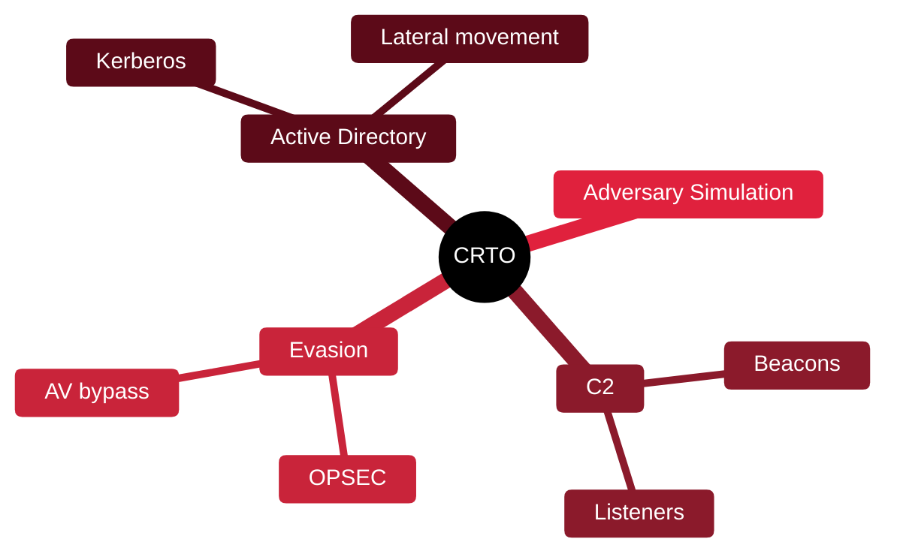

# 👹 CRTO — Certified Red Team Operator

[🏠 Profile](https://github.com/RochaCrypt) · [📚 Catalog](../README.md) · 

> Zero-Point Security · red-team operations with C2 and evasion.

## 🔎 What it is

A practical red-team certification centred on adversary simulation using a command-and-control framework, focusing on tradecraft, evasion and Active Directory attacks the way a real red team operates.

## 🎯 What it validates

- Command-and-control (C2) operations
- Defence evasion and OPSEC
- Active Directory attack paths
- Adversary simulation aligned to ATT&CK

## 🧠 Key concepts & definitions

| Term | Definition |
| :--- | :--- |
| **C2 framework** | Software controlling compromised hosts (e.g. Cobalt Strike) |
| **Beacon** | An implant that checks in with the C2 server |
| **OPSEC** | Operating without tipping off defenders |
| **Tradecraft** | The techniques and discipline of covert operations |
| **Adversary simulation** | Emulating a specific threat actor's behaviour |

## 🗺️ Mind map

## 📌 Fast facts

| | |
| :--- | :--- |
| Issuer | Zero-Point Security |
| Level | Intermediate–Advanced ⭐⭐⭐⭐ |
| Format | Lab-based exam |
| Focus | Red team / C2 |

## 🔥 In the field

- Red teaming is as much about staying quiet as about getting in.
- Mapping actions to ATT&CK makes the exercise measurable for the blue team.

## 🔗 Official

- [Zero-Point Security CRTO](https://training.zeropointsecurity.co.uk/courses/red-team-ops)

---

