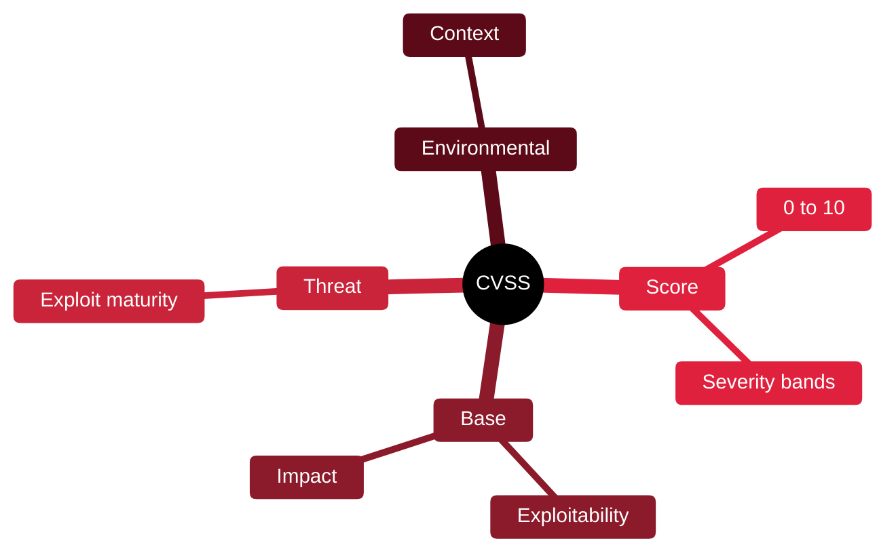

# 🌡️ CVSS — Common Vulnerability Scoring System

[🏠 Profile](https://github.com/RochaCrypt) · [📚 Catalog](../README.md) · 

> FIRST · a standard way to score vulnerability severity.

## 🔎 What it is

An open standard for rating the severity of vulnerabilities on a 0–10 scale. It provides a consistent, comparable score so teams can prioritise remediation across many findings.

## 🎯 What it validates

- Scores vulnerability severity 0–10
- Breaks severity into measurable metrics
- Enables consistent prioritisation
- Underlies most vulnerability reports

## 🧠 Key concepts & definitions

| Term | Definition |
| :--- | :--- |
| **Base score** | Intrinsic severity independent of environment |
| **Temporal/Threat** | Adjusts for exploit maturity over time |
| **Environmental** | Adjusts for your specific context |
| **Attack vector** | How the flaw is reached (network, local, physical) |
| **Severity rating** | None, Low, Medium, High, Critical bands |

## 🗺️ Mind map

## 📌 Fast facts

| | |
| :--- | :--- |
| Maintained by | FIRST |
| Version | 4.0 |
| Range | 0.0–10.0 |
| Use | Prioritising remediation |

## 🔥 In the field

- A raw CVSS score isn't priority: a 9.8 no one can reach may matter less than a 6 that's exposed.
- Environmental metrics are underused — they make the score fit *your* risk.

## 🔗 Official

- [FIRST CVSS](https://www.first.org/cvss/)

---

