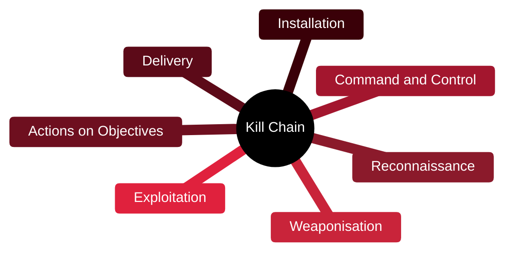

# ⛓️ Cyber Kill Chain

[🏠 Profile](https://github.com/RochaCrypt) · [📚 Catalog](../README.md) · 

> Lockheed Martin · a 7-stage model of how intrusions unfold.

## 🔎 What it is

A model describing the stages of a targeted attack, from reconnaissance to actions on objectives. It helps defenders reason about where in an intrusion they can detect and disrupt an attacker.

## 🎯 What it validates

- Breaks an intrusion into 7 stages
- Highlights points to detect and disrupt
- Frames defensive strategy
- Complements MITRE ATT&CK

## 🧠 Key concepts & definitions

| Term | Definition |
| :--- | :--- |
| **Weaponisation** | Pairing an exploit with a payload |
| **Delivery** | Getting the payload to the target (e.g. phishing) |
| **Exploitation** | Triggering the vulnerability |
| **Installation** | Establishing a foothold |
| **Actions on objectives** | The attacker's ultimate goal, e.g. data theft |

## 🗺️ Mind map

## 📌 Fast facts

| | |
| :--- | :--- |
| Maintained by | Lockheed Martin |
| Type | Conceptual model |
| Stages | 7 |
| Use | Framing detection & disruption |

## 🔥 In the field

- Breaking the chain at any early stage stops the whole attack.
- Simpler than ATT&CK for explaining intrusions to non-technical leaders.

## 🔗 Official

- [Lockheed Martin Cyber Kill Chain](https://www.lockheedmartin.com/en-us/capabilities/cyber/cyber-kill-chain.html)

---

