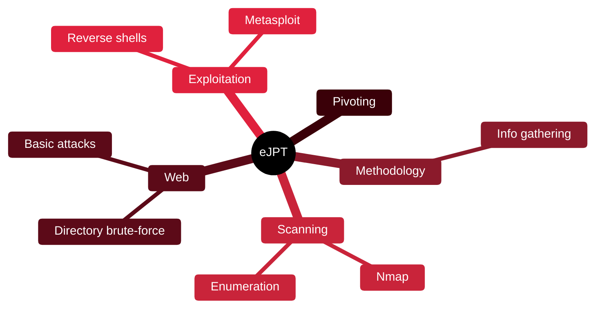

# 🐣 eJPT — Junior Penetration Tester

[🏠 Profile](https://github.com/RochaCrypt) · [📚 Catalog](../README.md) · 

> INE / eLearnSecurity · a practical, beginner-friendly entry into pentesting.

## 🔎 What it is

An entry-level, fully hands-on certification. You solve a small lab network and answer questions based on what you find. A popular first practical cert before OSCP.

## 🎯 What it validates

- Assessment methodology and information gathering
- Host and network scanning and enumeration
- Basic web application attacks
- Introductory exploitation and pivoting

## 🧠 Key concepts & definitions

| Term | Definition |
| :--- | :--- |
| **Enumeration** | Systematically listing services, ports and users on targets |
| **Reverse shell** | A shell where the target connects back to the attacker |
| **Directory brute-forcing** | Discovering hidden web paths with wordlists |
| **Pivoting** | Routing traffic through a compromised host to reach internal hosts |
| **Metasploit** | Framework for finding and running exploits |

## 🗺️ Mind map

## 📌 Fast facts

| | |
| :--- | :--- |
| Issuer | INE (eLearnSecurity) |
| Level | Beginner ⭐ |
| Format | Practical lab exam, open-book |
| Prereq | None |

## 🔥 In the field

- The best first practical cert: it builds a repeatable enumeration habit.
- Everything here scales up directly into OSCP preparation.

## 🔗 Official

- [INE eJPT](https://security.ine.com/certifications/ejpt-certification/)

---

