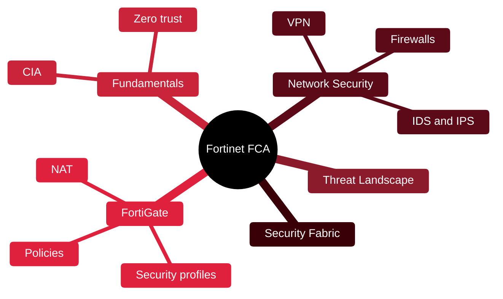

# 🧱 Fortinet Certified Associate

[🏠 Profile](https://github.com/RochaCrypt) · [📚 Catalog](../README.md) · 

> Fortinet · security fundamentals and FortiGate basics. 

## 🔎 What it is

An entry-level vendor certification covering the threat landscape, core security concepts and the fundamentals of the FortiGate next-generation firewall.

## 🎯 What it validates

- Threat landscape and security fundamentals
- Firewall and NGFW concepts
- VPN, IDS/IPS basics
- FortiGate policies and security profiles

## 🧠 Key concepts & definitions

| Term | Definition |
| :--- | :--- |
| **NGFW** | Next-Generation Firewall — adds app control, IPS, filtering to a firewall |
| **Stateful inspection** | Tracking connection state to allow return traffic |
| **Security profile** | App control, web filtering, antivirus applied to a policy |
| **VPN** | Encrypted tunnel between networks or users |
| **Security Fabric** | Fortinet's integrated, automated defence architecture |

## 🗺️ Mind map

## 📌 Fast facts

| | |
| :--- | :--- |
| Issuer | Fortinet |
| Level | Foundation ⭐ |
| Format | Free self-paced courses + exams |
| Focus | FortiGate fundamentals |

## 🔥 In the field

- Policy order matters: a broad rule too high silently shadows everything below.
- A policy without security profiles is just an old-school port filter.

## 🔗 Official

- [Fortinet Training Institute](https://training.fortinet.com/)

---

