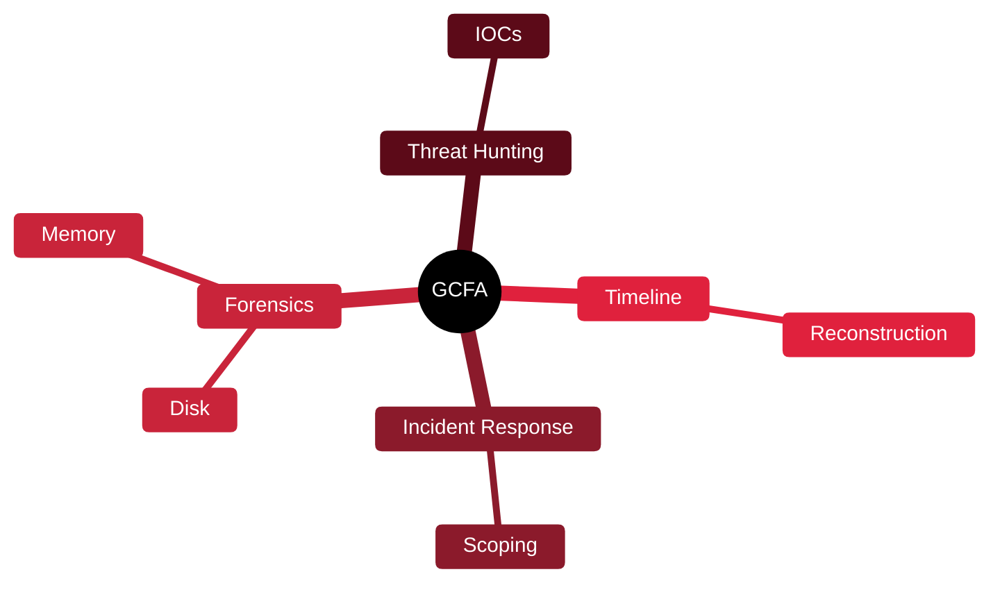

# 🔬 GCFA — GIAC Certified Forensic Analyst

[🏠 Profile](https://github.com/RochaCrypt) · [📚 Catalog](../README.md) · 

> GIAC / SANS (FOR508) · advanced forensics, DFIR and threat hunting.

## 🔎 What it is

An advanced digital forensics and incident response certification focused on investigating intrusions, hunting threats across enterprise systems and reconstructing what an attacker did.

## 🎯 What it validates

- Enterprise incident response
- Memory and disk forensics
- Threat hunting at scale
- Attacker timeline reconstruction

## 🧠 Key concepts & definitions

| Term | Definition |
| :--- | :--- |
| **Artifact** | A trace left by activity on a system (registry, logs, prefetch) |
| **Timeline analysis** | Ordering events to reconstruct an incident |
| **Memory forensics** | Analysing RAM for malware and activity |
| **IOC** | Indicator of Compromise |
| **Living off the land** | Attackers abusing built-in tools to avoid detection |

## 🗺️ Mind map

## 📌 Fast facts

| | |
| :--- | :--- |
| Issuer | GIAC (SANS FOR508) |
| Level | Advanced ⭐⭐⭐⭐ |
| Format | Proctored, open-book |
| Validity | 4 years |

## 🔥 In the field

- Forensics turns 'we think we were breached' into a defensible timeline of facts.
- Knowing attacker artifacts tells you exactly where to look after an alert.

## 🔗 Official

- [GIAC GCFA](https://www.giac.org/certifications/certified-forensic-analyst-gcfa/)

---

