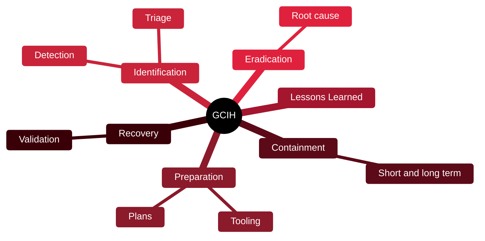

# 🚨 GCIH — GIAC Certified Incident Handler

[🏠 Profile](https://github.com/RochaCrypt) · [📚 Catalog](../README.md) · 

> GIAC / SANS · incident handling and attacker techniques.

## 🔎 What it is

A respected certification (SANS SEC504) on detecting, responding to and recovering from incidents, taught through the lens of the attacker techniques you'll defend against.

## 🎯 What it validates

- The incident handling process end to end
- Common attack tools and techniques
- Detection and containment strategies
- Recovery and lessons learned

## 🧠 Key concepts & definitions

| Term | Definition |
| :--- | :--- |
| **Incident handling lifecycle** | Prepare, Identify, Contain, Eradicate, Recover, Lessons learned |
| **Containment** | Limiting an incident's spread before eradication |
| **Persistence** | How attackers keep access across reboots |
| **Eradication** | Removing the attacker and root cause from the environment |
| **Chain of custody** | Documented handling of evidence for integrity |

## 🗺️ Mind map

## 📌 Fast facts

| | |
| :--- | :--- |
| Issuer | GIAC (SANS SEC504) |
| Level | Intermediate ⭐⭐⭐ |
| Format | Proctored exam, open-book (own notes) |
| Validity | 4 years |

## 🔥 In the field

- A tested incident plan beats any single tool when things go wrong.
- Understanding attacker persistence tells defenders exactly what to hunt for.

## 🔗 Official

- [GIAC GCIH](https://www.giac.org/certifications/certified-incident-handler-gcih/)

---

