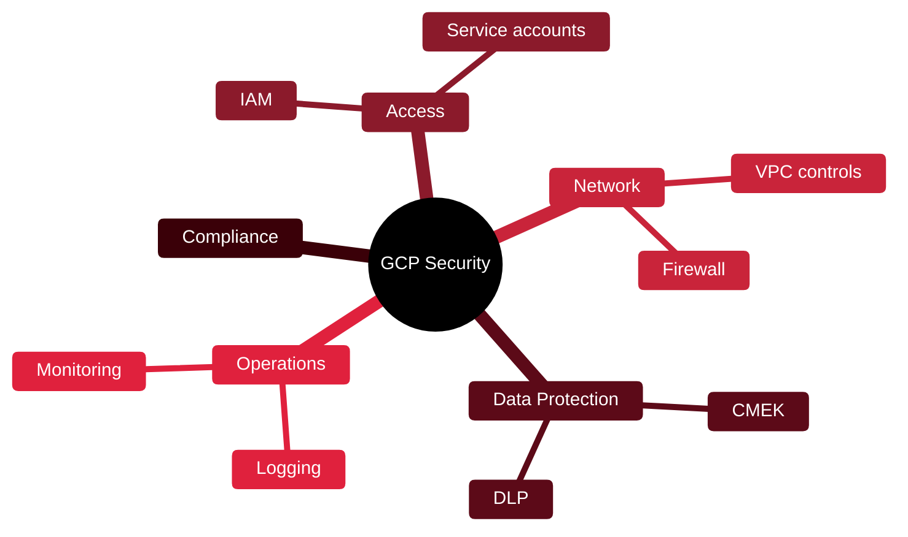

# 🟥 GCP Professional Cloud Security Engineer

[🏠 Profile](https://github.com/RochaCrypt) · [📚 Catalog](../README.md) · 

> Google Cloud · securing workloads on GCP.

## 🔎 What it is

Google Cloud's professional security certification. Proves you can configure access, network security, data protection and compliance for workloads on Google Cloud.

## 🎯 What it validates

- Configuring identity and access (IAM)
- Network security and segmentation
- Data protection and encryption
- Managing operations and ensuring compliance

## 🧠 Key concepts & definitions

| Term | Definition |
| :--- | :--- |
| **IAM** | Identity and Access Management binding roles to principals |
| **VPC Service Controls** | Perimeters that reduce data exfiltration risk |
| **CMEK** | Customer-Managed Encryption Keys |
| **Org policy** | Guardrails applied across the resource hierarchy |
| **Least privilege** | Grant only the roles actually required |

## 🗺️ Mind map

## 📌 Fast facts

| | |
| :--- | :--- |
| Issuer | Google Cloud |
| Level | Advanced ⭐⭐⭐⭐ |
| Format | MCQ + multiple-select · 2h |
| Validity | 2 years |

## 🔥 In the field

- VPC Service Controls are GCP's key answer to data exfiltration.
- Service-account sprawl is a common, dangerous source of over-permission.

## 🔗 Official

- [Google Cloud Security Engineer](https://cloud.google.com/learn/certification/cloud-security-engineer)

---

