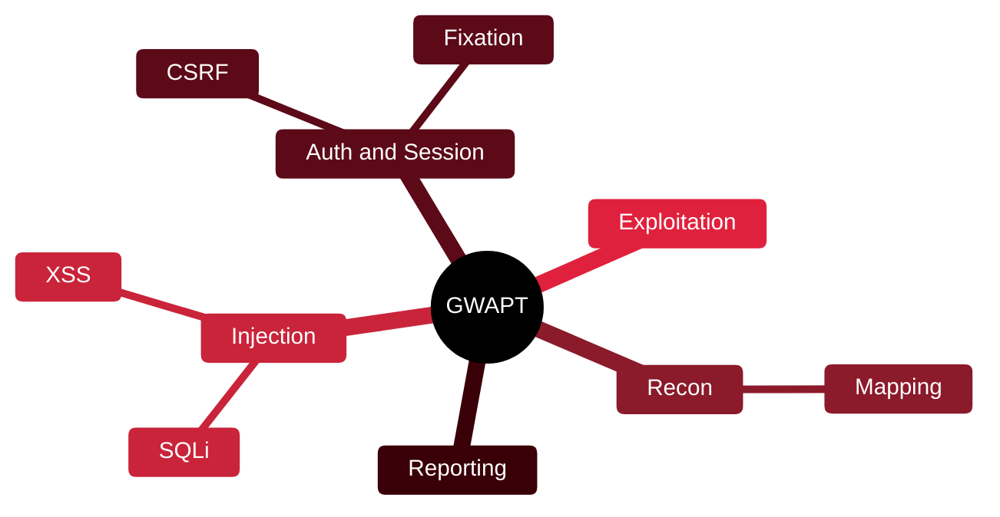

# 🌐 GWAPT — GIAC Web Application Penetration Tester

[🏠 Profile](https://github.com/RochaCrypt) · [📚 Catalog](../README.md) · 

> GIAC / SANS (SEC542) · structured web application penetration testing.

## 🔎 What it is

A GIAC certification covering a methodical approach to finding and exploiting web application vulnerabilities, from reconnaissance through exploitation and reporting.

## 🎯 What it validates

- Web recon and mapping
- Injection and XSS exploitation
- Authentication and session attacks
- Reporting web findings

## 🧠 Key concepts & definitions

| Term | Definition |
| :--- | :--- |
| **XSS** | Cross-Site Scripting — injecting scripts into pages other users see |
| **CSRF** | Forcing a user's browser to make unwanted requests |
| **SQLi** | Injecting SQL to manipulate a database |
| **Session fixation** | Forcing a known session ID onto a victim |
| **Proxy** | Tool (e.g. Burp) intercepting and modifying web traffic |

## 🗺️ Mind map

## 📌 Fast facts

| | |
| :--- | :--- |
| Issuer | GIAC (SANS SEC542) |
| Level | Intermediate ⭐⭐⭐ |
| Format | Proctored, open-book |
| Validity | 4 years |

## 🔥 In the field

- A repeatable web methodology beats scanning tools that miss logic flaws.
- Burp proxy skills transfer to almost every web engagement.

## 🔗 Official

- [GIAC GWAPT](https://www.giac.org/certifications/web-application-penetration-tester-gwapt/)

---

