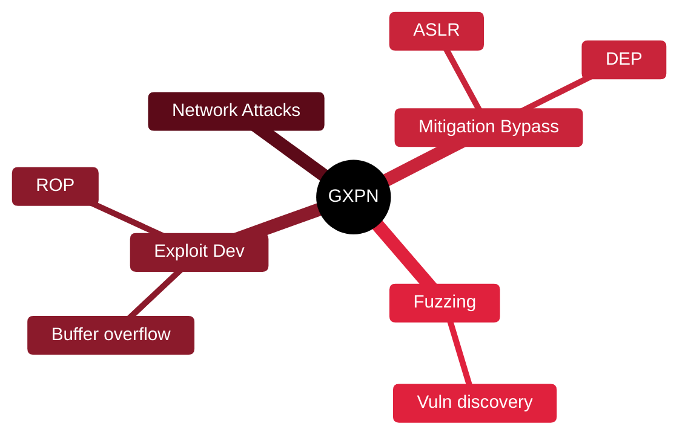

# 🧬 GXPN — Exploit Researcher & Advanced Pentester

[🏠 Profile](https://github.com/RochaCrypt) · [📚 Catalog](../README.md) · 

> GIAC / SANS (SEC660) · advanced exploitation and exploit development.

## 🔎 What it is

An advanced GIAC certification covering exploit development, advanced network attacks and techniques that go beyond running existing tools — including writing your own exploits.

## 🎯 What it validates

- Exploit development fundamentals
- Advanced network and crypto attacks
- Bypassing exploit mitigations
- Fuzzing and vulnerability discovery

## 🧠 Key concepts & definitions

| Term | Definition |
| :--- | :--- |
| **Buffer overflow** | Overwriting memory to hijack execution |
| **ASLR/DEP** | Memory protections exploits must bypass |
| **Fuzzing** | Feeding malformed input to find crashes/bugs |
| **ROP** | Return-Oriented Programming to bypass DEP |
| **Shellcode** | Payload executed once control is hijacked |

## 🗺️ Mind map

## 📌 Fast facts

| | |
| :--- | :--- |
| Issuer | GIAC (SANS SEC660) |
| Level | Expert ⭐⭐⭐⭐⭐ |
| Format | Proctored, open-book |
| Validity | 4 years |

## 🔥 In the field

- Understanding memory corruption makes you far better at judging real risk.
- Even if you never write exploits, knowing how they work sharpens triage.

## 🔗 Official

- [GIAC GXPN](https://www.giac.org/certifications/exploit-researcher-advanced-penetration-tester-gxpn/)

---

