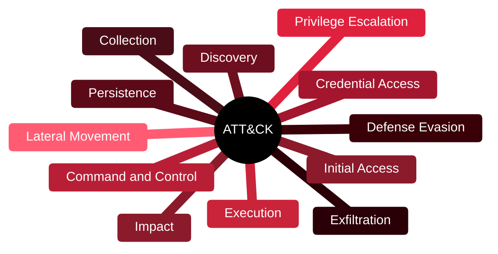

# 🎛️ MITRE ATT&CK

[🏠 Profile](https://github.com/RochaCrypt) · [📚 Catalog](../README.md) · 

> A knowledge base of real-world adversary tactics and techniques.

## 🔎 What it is

A free, globally used matrix that catalogues how attackers behave — organised as tactics (their goals) and techniques (how they achieve them), based on observed real-world activity.

## 🎯 What it validates

- Maps attacker behaviour across 14 enterprise tactics
- Gives every technique a shared ID (e.g. T1059)
- Powers detection engineering and threat hunting
- Enables red/blue teams to speak the same language

## 🧠 Key concepts & definitions

| Term | Definition |
| :--- | :--- |
| **Tactic** | The attacker's goal in a phase (e.g. Persistence) |
| **Technique** | How the goal is achieved (e.g. Scheduled Task) |
| **Sub-technique** | A more specific variation of a technique |
| **Procedure** | A specific real-world implementation by a group |
| **Coverage mapping** | Checking which techniques your detections actually catch |

## 🗺️ Mind map

## 📌 Fast facts

| | |
| :--- | :--- |
| Maintained by | MITRE |
| Type | Free knowledge base |
| Enterprise tactics | 14 |
| Use | Detection, hunting, red/blue teaming |

## 🔥 In the field

- Mapping detections to ATT&CK turns 'we have alerts' into 'we cover these behaviours'.
- The shared IDs make red-team reports directly actionable for the blue team.

## 🔗 Official

- [MITRE ATT&CK](https://attack.mitre.org/)

---

