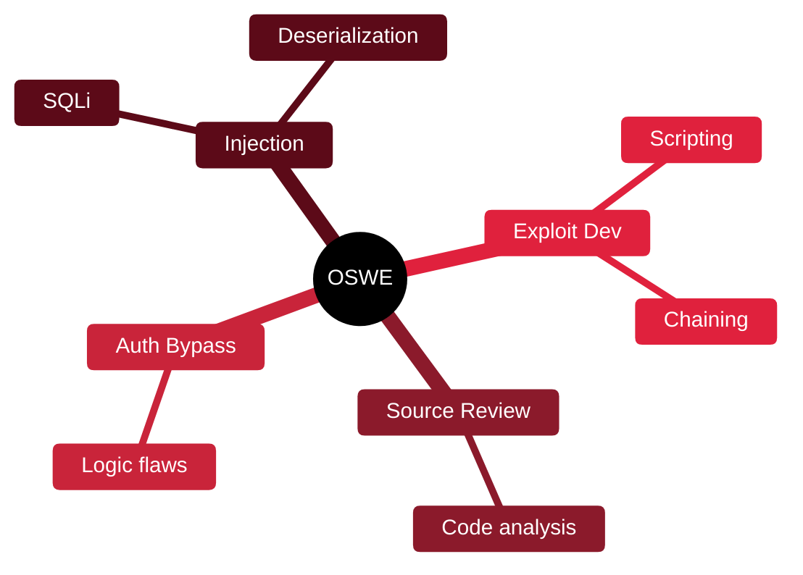

# 🕷️ OSWE — OffSec Web Expert

[🏠 Profile](https://github.com/RochaCrypt) · [📚 Catalog](../README.md) · 

> OffSec (WEB-300) · white-box web application exploitation.

## 🔎 What it is

An advanced web-focused certification built around white-box testing: reading source code to find and chain vulnerabilities into working exploits. Part of the OSCE3 group.

## 🎯 What it validates

- Source code review for vulnerabilities
- Authentication bypasses
- Chaining bugs into full exploits
- Writing custom exploit scripts

## 🧠 Key concepts & definitions

| Term | Definition |
| :--- | :--- |
| **White-box testing** | Testing with full access to source code |
| **Auth bypass** | Defeating login or session controls |
| **Deserialization** | Abuse of unsafe object deserialization for code execution |
| **Blind injection** | Exploiting a flaw with no direct output |
| **Exploit chaining** | Combining several weaknesses into one impactful attack |

## 🗺️ Mind map

## 📌 Fast facts

| | |
| :--- | :--- |
| Issuer | OffSec (WEB-300) |
| Level | Expert ⭐⭐⭐⭐⭐ |
| Format | ~48h practical + report |
| Focus | White-box web |

## 🔥 In the field

- Reading code finds logic bugs that black-box scanning never will.
- Turning a bug into a reliable exploit is the skill clients actually pay for.

## 🔗 Official

- [OffSec WEB-300](https://www.offsec.com/courses/web-300/)

---

