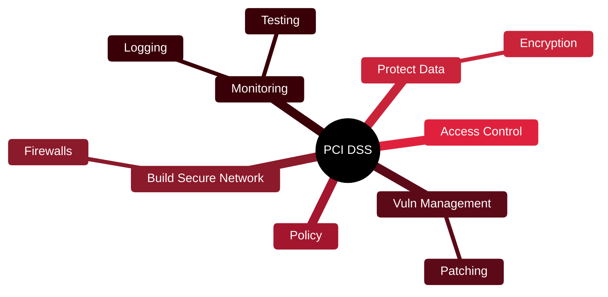

# 💳 PCI DSS

[🏠 Profile](https://github.com/RochaCrypt) · [📚 Catalog](../README.md) · 

> PCI SSC · the security standard for handling payment card data.

## 🔎 What it is

A mandatory security standard for any organisation that stores, processes or transmits payment card data. Version 4.0 organises 12 requirements under six goals, with compliance often contractually required.

## 🎯 What it validates

- Protects cardholder data end to end
- Defines 12 requirements across 6 goals
- Mandates network, access and monitoring controls
- Requires regular testing and assessment

## 🧠 Key concepts & definitions

| Term | Definition |
| :--- | :--- |
| **Cardholder data** | The card number and related sensitive data |
| **Segmentation** | Isolating the cardholder environment to shrink scope |
| **Scope** | The systems that touch card data and must comply |
| **Compensating control** | An alternative when a requirement can't be met directly |
| **QSA** | Qualified Security Assessor who validates compliance |

## 🗺️ Mind map

## 📌 Fast facts

| | |
| :--- | :--- |
| Maintained by | PCI Security Standards Council |
| Version | 4.0 |
| Requirements | 12 in 6 goals |
| Nature | Often contractually mandatory |

## 🔥 In the field

- Reducing scope through segmentation is the biggest lever for cost and effort.
- Compliance is a floor, not a ceiling — passing an assessment isn't 'secure'.

## 🔗 Official

- [PCI Security Standards Council](https://www.pcisecuritystandards.org/)

---

