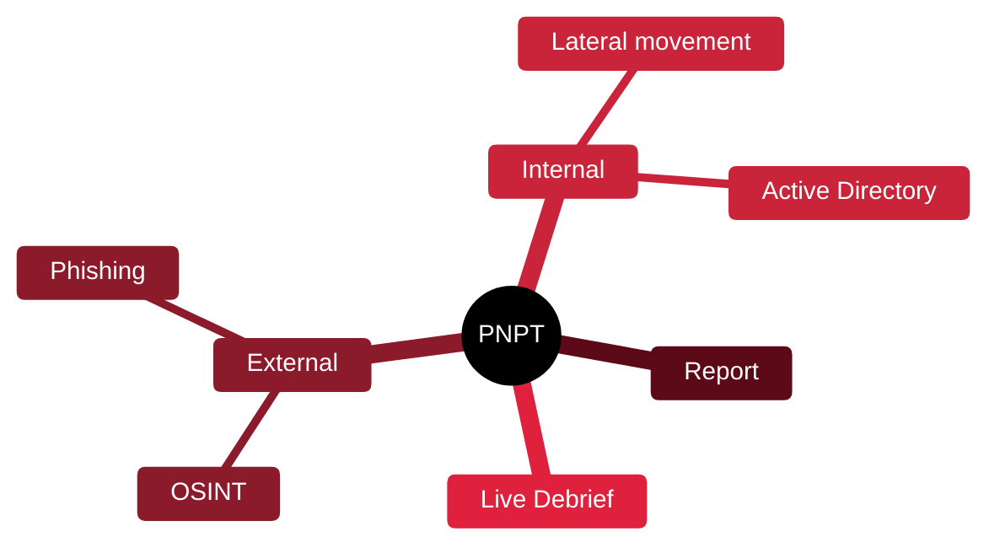

# 🎖️ PNPT — Practical Network Penetration Tester

[🏠 Profile](https://github.com/RochaCrypt) · [📚 Catalog](../README.md) · 

> TCM Security · a realistic external-to-internal engagement with a live debrief.

## 🔎 What it is

A practical, affordable certification simulating a real engagement: external recon, phishing, internal Active Directory compromise, a full report, and a live debrief where you present findings to assessors.

## 🎯 What it validates

- OSINT and external attack
- Active Directory exploitation
- Professional report writing
- A live 15-minute debrief presentation

## 🧠 Key concepts & definitions

| Term | Definition |
| :--- | :--- |
| **OSINT** | Open-source intelligence gathered before attacking |
| **Assumed breach** | Starting from a foothold to test internal defences |
| **Pivoting** | Reaching internal networks through a compromised host |
| **Debrief** | Presenting findings to the client as a real consultant would |
| **Report** | The professional deliverable that carries the value |

## 🗺️ Mind map

## 📌 Fast facts

| | |
| :--- | :--- |
| Issuer | TCM Security |
| Level | Intermediate ⭐⭐⭐ |
| Format | 5-day exam + report + live debrief |
| Note | No automated exploitation tools |

## 🔥 In the field

- The live debrief mirrors real consulting — few certs test that.
- Excellent value bridge between eJPT and OSCP.

## 🔗 Official

- [TCM Security PNPT](https://certifications.tcm-sec.com/pnpt/)

---

