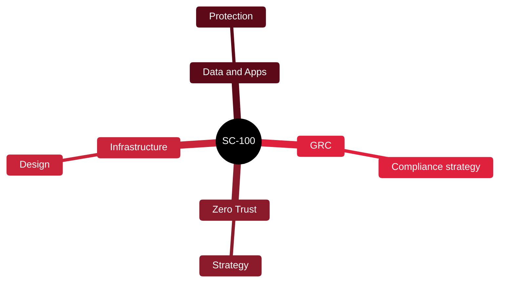

# 🏢 SC-100 — Microsoft Cybersecurity Architect

[🏠 Profile](https://github.com/RochaCrypt) · [📚 Catalog](../README.md) · 

> Microsoft · designing enterprise security strategy and Zero Trust.

## 🔎 What it is

Microsoft's expert-level architect certification. Proves you can design a cybersecurity strategy across identity, operations, data and infrastructure, grounded in Zero Trust. Requires another associate certification first.

## 🎯 What it validates

- Designing Zero Trust strategy
- Security for infrastructure and data
- GRC strategy design
- Aligning security architecture to business

## 🧠 Key concepts & definitions

| Term | Definition |
| :--- | :--- |
| **Zero Trust** | Verify explicitly, least privilege, assume breach |
| **Security posture** | The overall strength of an organisation's defences |
| **Landing zone** | A secure, well-architected cloud foundation |
| **Defence in depth** | Layered controls across the estate |
| **Reference architecture** | A proven design template to build from |

## 🗺️ Mind map

## 📌 Fast facts

| | |
| :--- | :--- |
| Issuer | Microsoft |
| Level | Expert ⭐⭐⭐⭐⭐ |
| Format | MCQ + case studies |
| Prereq | An associate cert (e.g. AZ-500/SC-200) |

## 🔥 In the field

- Architecture work is about trade-offs and strategy, not clicking settings.
- Zero Trust is the organising principle behind most modern Microsoft security design.

## 🔗 Official

- [Microsoft SC-100](https://learn.microsoft.com/en-us/credentials/certifications/cybersecurity-architect-expert/)

---

