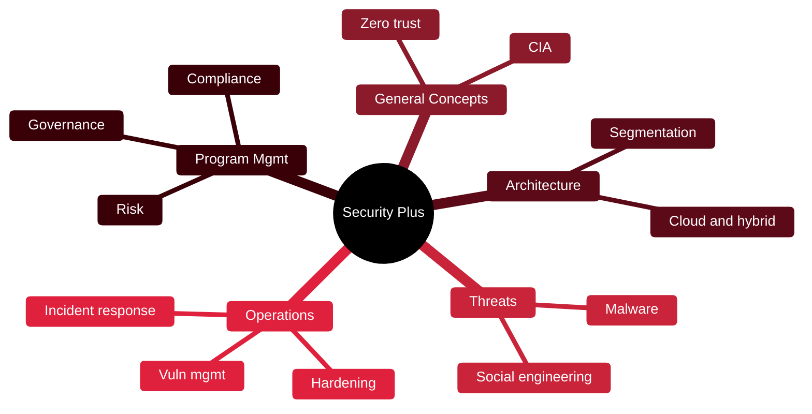

# 🛡️ CompTIA Security+

[🏠 Profile](https://github.com/RochaCrypt) · [📚 Catalog](../README.md) · 

> CompTIA · the standard entry point into security roles.

## 🔎 What it is

A vendor-neutral, foundational certification covering core security across five domains. Often the first cert on a security résumé and a baseline requirement for many jobs.

## 🎯 What it validates

- Core concepts, cryptography and zero trust
- Threats, vulnerabilities and mitigations
- Secure architecture for cloud and hybrid
- Security operations and program/governance

## 🧠 Key concepts & definitions

| Term | Definition |
| :--- | :--- |
| **Zero trust** | Never trust, always verify — no implicit trust by network location |
| **Defence in depth** | Layering controls so no single failure is fatal |
| **CIA triad** | Confidentiality, Integrity, Availability |
| **Risk** | Likelihood × impact of a threat exploiting a vulnerability |
| **IAM** | Identity and Access Management — who can do what |

## 🗺️ Mind map

## 📌 Fast facts

| | |
| :--- | :--- |
| Issuer | CompTIA (SY0-701) |
| Level | Foundation ⭐ |
| Format | ≤90 questions · 90 min · 750/900 to pass |
| Validity | 3 years |

## 🔥 In the field

- Domain 4 (Security Operations, ~28%) is the actual day job for SOC and VM teams.
- Gives you the shared vocabulary used in every report, audit and interview.

## 🔗 Official

- [CompTIA Security+](https://www.comptia.org/en-us/certifications/security/)

---

