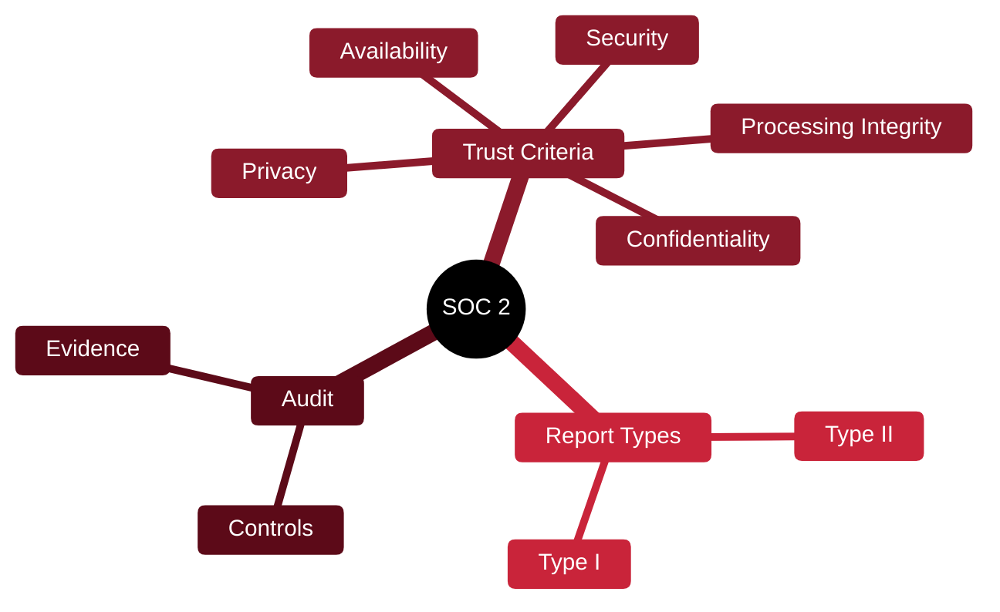

# 📑 SOC 2

[🏠 Profile](https://github.com/RochaCrypt) · [📚 Catalog](../README.md) · 

> AICPA · a trust and assurance report for service providers.

## 🔎 What it is

An auditing standard from the AICPA that reports on a service provider's controls against five Trust Services Criteria. Common for SaaS companies proving security to customers, resulting in an auditor's report rather than a pass/fail badge.

## 🎯 What it validates

- Reports on controls to customers
- Covers up to 5 Trust Services Criteria
- Distinguishes Type I (design) vs Type II (operating)
- Builds customer trust in vendors

## 🧠 Key concepts & definitions

| Term | Definition |
| :--- | :--- |
| **Trust Services Criteria** | Security, Availability, Processing Integrity, Confidentiality, Privacy |
| **Type I** | Controls are suitably designed at a point in time |
| **Type II** | Controls operated effectively over a period |
| **Control** | A safeguard the auditor tests |
| **Assertion** | Management's claims the audit evaluates |

## 🗺️ Mind map

## 📌 Fast facts

| | |
| :--- | :--- |
| Maintained by | AICPA |
| Type | Attestation report |
| Criteria | 5 Trust Services |
| Common for | SaaS / service providers |

## 🔥 In the field

- Type II matters more than Type I — it proves controls worked over time.
- Increasingly a prerequisite to sell software into larger enterprises.

## 🔗 Official

- [AICPA SOC 2](https://www.aicpa-cima.com/topic/audit-assurance/audit-and-assurance-greater-than-soc-2)

---

