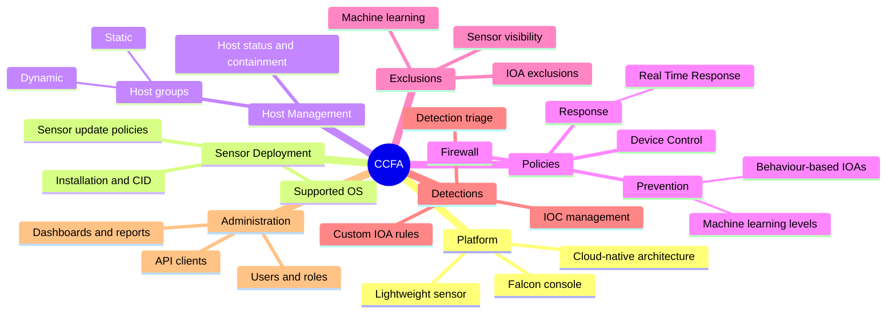

# 🦅 CCFA — CrowdStrike Certified Falcon Administrator

[← Back to index](../README.md)

## 🗺️ Mind Map

## 🧩 Core Concepts

| Concept | Why it matters |
| :--- | :--- |
| **Host groups** | Policies are assigned to groups, so group design drives everything else |
| **Policy precedence** | A host gets the highest-precedence policy of its groups — order is critical |
| **Prevention vs detection** | Start new policies in detect mode, tune, then enable prevention |
| **Exclusions** | Each type suppresses something different; overly broad exclusions are a blind spot |
| **Real Time Response** | Remote shell on the endpoint for triage and containment, governed by response policies and roles |
| **Least privilege** | RTR admin and policy-editing roles should be tightly limited |

## 🔥 In the Field

- **Design host groups before touching policies.** Separating servers, workstations and critical assets saves painful rework.
- **Treat exclusions as risk decisions.** Document who requested each one, why, and when it will be reviewed.
- **RTR is powerful in both directions.** It speeds up containment, but an attacker with console access gets the same power, so protect it with MFA and strict roles.
- **Red-team your own EDR.** After an offensive test, review what Falcon detected, prevented and missed.

## ✅ Progress Checklist

- [ ] Platform architecture & sensor
- [ ] Deployment & update policies
- [ ] Host groups & precedence
- [ ] Prevention & response policies
- [ ] Exclusions
- [ ] Custom IOAs & IOCs
- [ ] Users, roles & API clients

## 🔗 Resources

- [CrowdStrike University & certification](https://www.crowdstrike.com/)
- [MITRE ATT&CK Evaluations](https://evals.mitre.org/)
