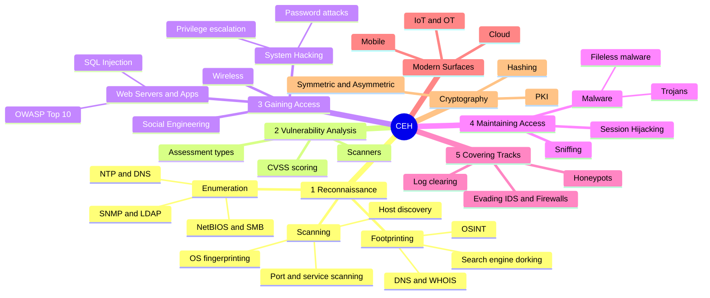

# ⚔️ CEH — Certified Ethical Hacker

[← Back to index](../README.md)

## 🗺️ Mind Map



## 🧩 The 5 Phases of Hacking

| # | Phase | Goal | Typical tools |
| :-: | :--- | :--- | :--- |
| 1 | **Reconnaissance** | Map the target without (passive) or with (active) interaction | WHOIS, theHarvester, Nmap |
| 2 | **Scanning** | Find live hosts, open ports, services and vulnerabilities | Nmap, Nessus, Qualys |
| 3 | **Gaining Access** | Exploit a weakness to get a foothold | Metasploit, Burp Suite, Hydra |
| 4 | **Maintaining Access** | Persist and move laterally | C2 frameworks, scheduled tasks |
| 5 | **Covering Tracks** | Remove evidence of activity | Log manipulation, timestomping |

## 📦 The 20 Modules

<details>
<summary><b>Show all modules</b></summary>
<br/>

1. Introduction to Ethical Hacking
2. Footprinting and Reconnaissance
3. Scanning Networks
4. Enumeration
5. Vulnerability Analysis
6. System Hacking
7. Malware Threats
8. Sniffing
9. Social Engineering
10. Denial-of-Service
11. Session Hijacking
12. Evading IDS, Firewalls and Honeypots
13. Hacking Web Servers
14. Hacking Web Applications
15. SQL Injection
16. Hacking Wireless Networks
17. Hacking Mobile Platforms
18. IoT and OT Hacking
19. Cloud Computing
20. Cryptography

</details>

## 🧰 Cheat Sheet — Nmap Essentials

```bash
nmap -sn 10.0.0.0/24            # host discovery (ping sweep)
nmap -sS -p- target             # SYN scan, all 65535 ports
nmap -sV -sC -p 22,80,443 target  # service versions + default scripts
nmap -O target                  # OS detection
nmap -Pn target                 # skip host discovery (ICMP blocked)
nmap -oA scan_results target    # save output in all formats
```

## 🔥 In the Field

- **Recon is where engagements are won.** Most critical findings trace back to something discovered during enumeration, not to a clever exploit.
- **Scanner output is a starting point.** Qualys or Nessus results need manual validation before they go into a report.
- **Covering tracks matters for defenders too.** Knowing what attackers delete tells you which logs to protect and forward to the SIEM.

## ✅ Progress Checklist

- [ ] Recon & footprinting
- [ ] Scanning & enumeration
- [ ] Vulnerability analysis
- [ ] System hacking
- [ ] Web apps & SQL injection
- [ ] Evasion techniques
- [ ] Cloud, IoT & mobile
- [ ] Cryptography

## 🔗 Resources

- [EC-Council — CEH official page](https://www.eccouncil.org/train-certify/certified-ethical-hacker-ceh/)
- [OWASP Top 10](https://owasp.org/www-project-top-ten/)
- [MITRE ATT&CK](https://attack.mitre.org/)
