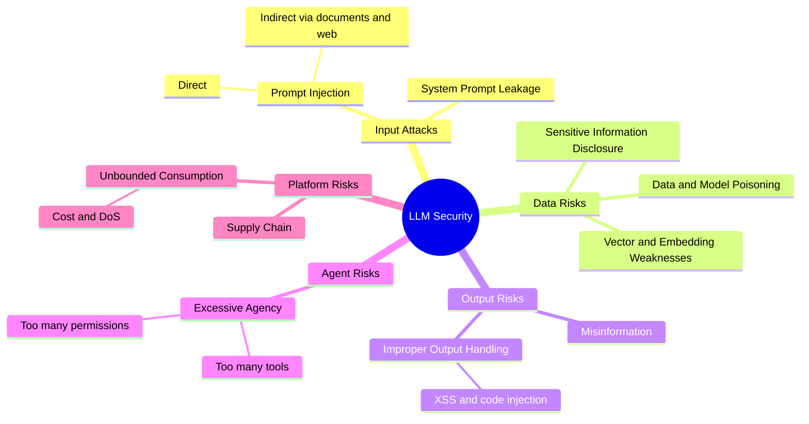

# 🤖 CLLMSP — LLM Application Security

[← Back to index](../README.md)

Mapped to the **OWASP Top 10 for LLM Applications (2025)**.

## 🗺️ Mind Map

## 🧩 OWASP Top 10 for LLMs — 2025

| ID | Risk | One-line takeaway |
| :--- | :--- | :--- |
| LLM01 | Prompt Injection | Treat every input, including retrieved documents, as untrusted |
| LLM02 | Sensitive Information Disclosure | The model can leak what it was trained on or given in context |
| LLM03 | Supply Chain | Models, datasets and plugins are third-party dependencies |
| LLM04 | Data and Model Poisoning | Tainted training or fine-tuning data creates hidden behaviour |
| LLM05 | Improper Output Handling | LLM output going into a browser, shell or SQL needs sanitising |
| LLM06 | Excessive Agency | Limit the tools, permissions and autonomy an agent has |
| LLM07 | System Prompt Leakage | Never put secrets or security logic in the system prompt |
| LLM08 | Vector and Embedding Weaknesses | RAG stores need access control and poisoning protection |
| LLM09 | Misinformation | Confident but wrong output is a security and trust risk |
| LLM10 | Unbounded Consumption | Rate-limit and cap usage to avoid cost and availability attacks |

## 🔥 In the Field

- **An LLM app is still a web app.** Classic testing (auth, authorisation, injection, rate limits) applies before any AI-specific testing.
- **Indirect prompt injection is the sleeper risk.** When an app reads emails, PDFs or web pages, the attacker writes the prompt.
- **Test the blast radius, not just the prompt.** What matters is what the model can *do* with its tools once manipulated.

## ✅ Progress Checklist

- [ ] Prompt injection (direct & indirect)
- [ ] Data leakage & system prompt leakage
- [ ] Output handling
- [ ] Agents & excessive agency
- [ ] RAG & embeddings
- [ ] Supply chain & poisoning

## 🔗 Resources

- [OWASP GenAI Security Project](https://genai.owasp.org/)
- [MITRE ATLAS](https://atlas.mitre.org/)
