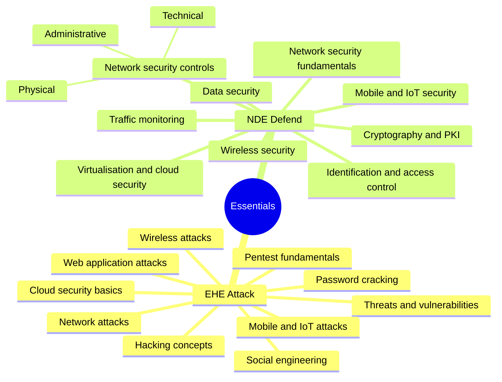

# 🛡️ EHE & NDE — EC-Council Essentials

[← Back to index](../README.md)

Two sides of the same coin: **Ethical Hacking Essentials** (attack) and **Network Defense Essentials** (defend).

## 🗺️ Mind Map

## ⚖️ Attack vs Defend

| Attack technique (EHE) | Defensive control (NDE) |
| :--- | :--- |
| Password cracking | MFA, strong password policy, account lockout |
| Social engineering | Awareness training, email filtering |
| Network sniffing | Encryption, network segmentation |
| Web application attacks | Secure coding, WAF |
| Wireless attacks | WPA3, wireless IDS |

## 🔗 Resources

- [EC-Council Essentials Series](https://www.eccouncil.org/)
