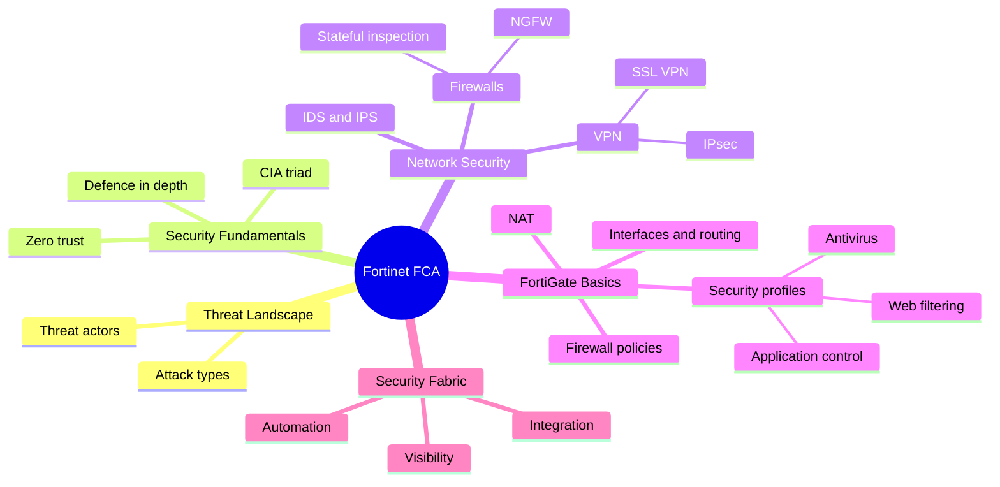

# 🧱 Fortinet Certified Associate in Cybersecurity

[← Back to index](../README.md)

## 🗺️ Mind Map

## 🔥 In the Field

- **Policy order matters.** FortiGate evaluates policies top-down; a broad rule too high silently shadows everything below it.
- **Security profiles are where NGFW value lives.** A policy without web filtering, IPS or app control is just an old-school port filter.
- **Centralise management at scale.** FortiManager keeps policy consistent across many firewalls.

## 🔗 Resources

- [Fortinet Training Institute](https://training.fortinet.com/)
