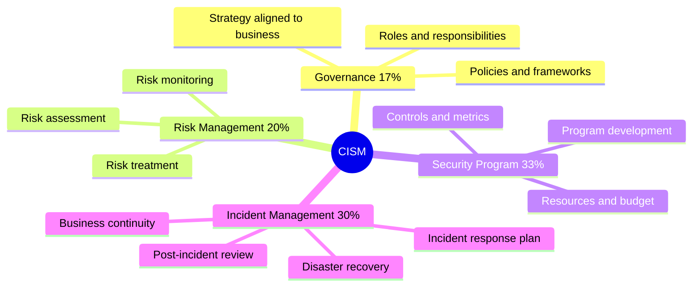

# 📊 CISM — Certified Information Security Manager

[← Back to index](../README.md) · 📖 *Study map — not a certification I hold*

ISACA's certification for people who run security programmes rather than individual controls.

## 🗺️ Mind Map

> Check the [official ISACA outline](https://www.isaca.org/credentialing/cism) for the latest version.

## 🔥 In the Field

- **Metrics sell security.** Executives fund programmes they can measure — remediation time, coverage, risk trend.
- **Incident management is 30% for a reason.** A tested plan matters more than any single tool.
