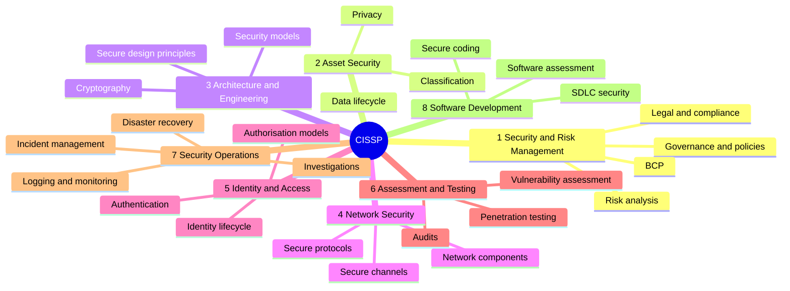

# 🏛️ CISSP — Certified Information Systems Security Professional

[← Back to index](../README.md) · 📖 *Study map — not a certification I hold*

The senior, management-level security certification from ISC2. Requires 5 years of paid experience across its domains.

## 🗺️ Mind Map

| # | Domain | Weight |
| :-: | :--- | :-: |
| 1 | Security and Risk Management | 16% |
| 2 | Asset Security | 10% |
| 3 | Security Architecture and Engineering | 13% |
| 4 | Communication and Network Security | 13% |
| 5 | Identity and Access Management | 13% |
| 6 | Security Assessment and Testing | 12% |
| 7 | Security Operations | 13% |
| 8 | Software Development Security | 10% |

> Check the [official ISC2 exam outline](https://www.isc2.org/certifications/cissp) for the latest weights.

## 🔥 In the Field

- **Think like a manager, not a technician.** The "best" answer is usually the one that addresses risk and business impact.
- **Domain 6 is where pentesters shine.** Assessment and testing is the bridge between offensive work and governance.
