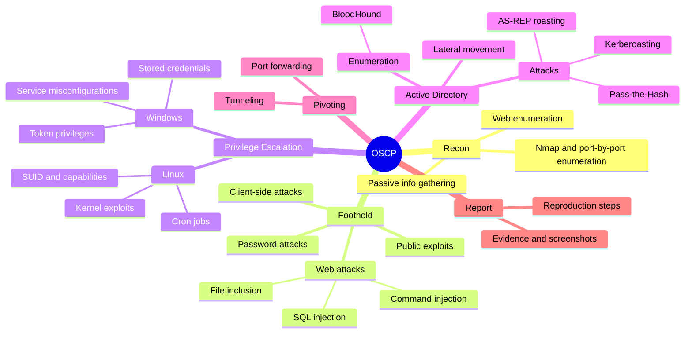

# 🗡️ OSCP — OffSec Certified Professional (PEN-200)

[← Back to index](../README.md) · 📖 *Study map — not a certification I hold*

The hands-on benchmark for penetration testers: a proctored practical exam, not multiple choice.

## 🗺️ Mind Map

## 🎯 Exam Format (OSCP+)

| Item | Detail |
| :--- | :--- |
| **Hacking window** | ~24 hours, proctored |
| **Report window** | Another 24 hours — no report, no pass |
| **Standalone machines** | 3 × 20 pts = 60 pts |
| **Active Directory set** | 3 machines = 40 pts (10 + 10 + 20), assumed-breach start with a domain user |
| **Pass mark** | 70 / 100 — no bonus points since Nov 2024 |
| **Metasploit** | Allowed on one target only |
| **Banned** | AI chatbots, automated exploitation tools, mass vulnerability scanners |

> Always confirm current rules in the [official OffSec exam guide](https://help.offsec.com/).

## 🔥 In the Field

- **Enumeration is the whole game.** Most stuck moments come from a service or share you didn't look at closely enough.
- **AD is 40% of the exam and most of real internal tests.** Kerberoasting, credential reuse and misconfigured ACLs are everyday findings.
- **The report is part of the grade.** Writing each lab box up as a proper finding builds the habit clients actually pay for.

## ✅ Progress Checklist

- [ ] Enumeration methodology per port
- [ ] Web attacks
- [ ] Linux privesc
- [ ] Windows privesc
- [ ] AD enumeration & attacks
- [ ] Pivoting & tunneling
- [ ] Report template ready
