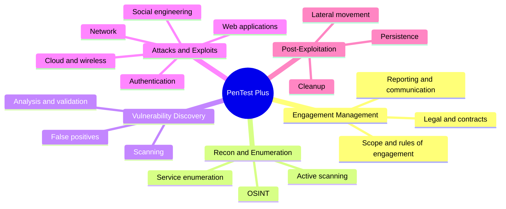

# 🎯 CompTIA PenTest+ (PT0-003)

[← Back to index](../README.md) · 📖 *Study map — not a certification I hold*

Vendor-neutral penetration testing, covering both the technical work and engagement management.

## 🗺️ Mind Map

| Domain | Weight |
| :--- | :-: |
| Engagement Management | 13% |
| Reconnaissance and Enumeration | 21% |
| Vulnerability Discovery and Analysis | 17% |
| Attacks and Exploits | 35% |
| Post-exploitation and Lateral Movement | 14% |

> Check the [official CompTIA objectives](https://www.comptia.org/certifications/pentest) for the latest version.

## 🔥 In the Field

- **Scope and rules of engagement protect you.** Written authorisation is what separates a pentest from a crime.
- **Cleanup is part of the job.** Remove every account, file and shell you created, and document it.
