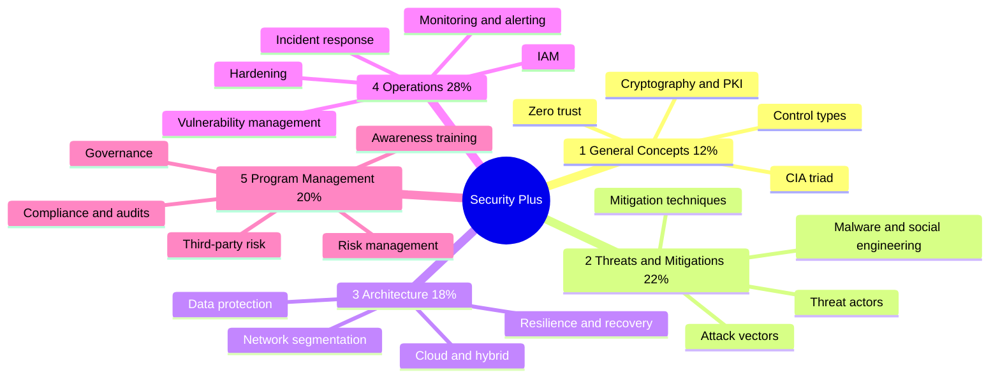

# 🛡️ CompTIA Security+ (SY0-701)

[← Back to index](../README.md) · 📖 *Study map — not a certification I hold*

The most common entry point into security roles: vendor-neutral and broad.

## 🗺️ Mind Map

## 🎯 Exam Format

| Item | Detail |
| :--- | :--- |
| **Questions** | Up to 90 — multiple choice + performance-based |
| **Time** | 90 minutes |
| **Pass mark** | 750 on a 100–900 scale |

> Heaviest domain: **Security Operations (28%)**. Check the [official CompTIA objectives](https://www.comptia.org/certifications/security) for the latest version.

## 🔥 In the Field

- **Domain 4 is the day job.** Hardening, vulnerability management and incident response are what SOC and VM teams do every week.
- **Know the vocabulary cold.** Security+ gives you the shared language used in reports, audits and interviews.
